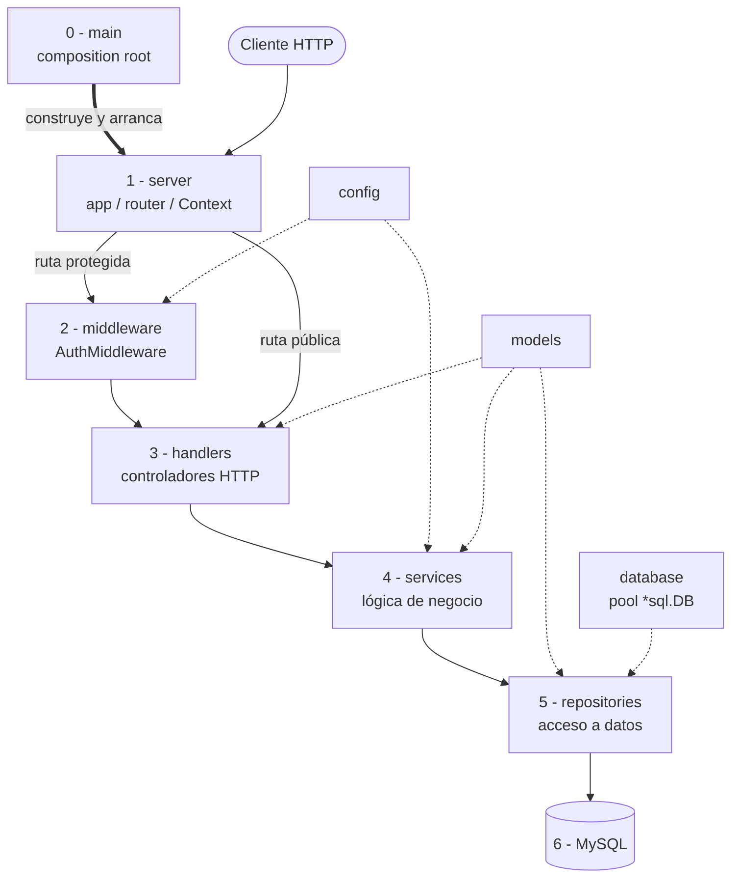
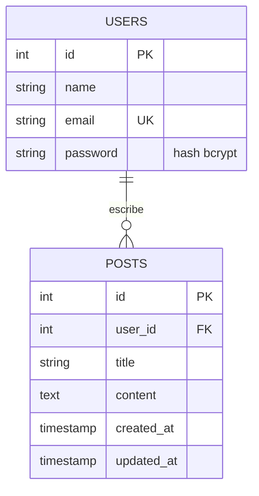
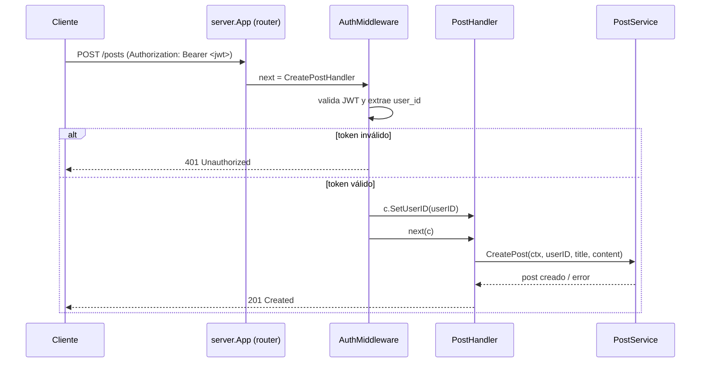
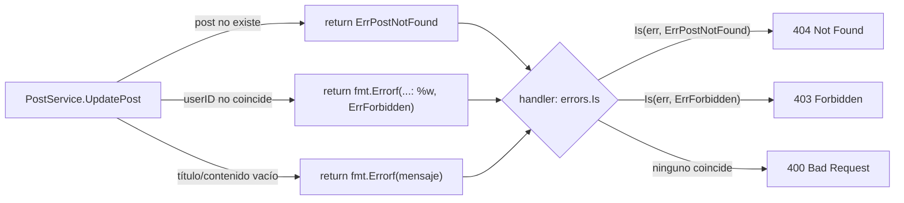

# Guía de Desarrollo — GoPost API REST


Tutorial paso a paso para reproducir el desarrollo de esta API REST en Go, explicando en cada paso **qué** se construye, **por qué** se toma esa decisión arquitectónica y **qué patrón de diseño** hay detrás.

## Índice

- [[#1. Introducción]]
- [[#2. Stack tecnológico]]
- [[#3. Arquitectura general]]
- [[#4. Estructura de carpetas]]
- [[#5. Paso 1 Inicializar el proyecto y dependencias]]
- [[#6. Paso 2 Esquema de base de datos]]
- [[#7. Paso 3 Capa de configuración]]
- [[#8. Paso 4 Capa de conexión a base de datos]]
- [[#9. Paso 5 Modelos de dominio]]
- [[#10. Paso 6 Framework HTTP propio (`server/`)]]
	- [[#10.1 `Context` el objeto que viaja con cada petición]]
	- [[#10.2 `App` y el router]]
	- [[#10.3 Errores HTTP uniformes]]
- [[#11. Paso 7 Capa de repositorios (Repository Pattern)]]
- [[#12. Paso 8 Capa de servicios (lógica de negocio)]]
	- [[#12.1 Autenticación hashing y JWT]]
	- [[#12.2 Servicio de posts y errores sentinela]]
- [[#13. Paso 9 Capa de handlers (controladores HTTP)]]
	- [[#13.1 Mapeo de errores de negocio a códigos HTTP]]
	- [[#13.2 No filtrar errores internos al cliente]]
- [[#14. Paso 10 Middleware de autenticación (JWT)]]
- [[#15. Paso 11 Composición raíz (`main.go`)]]
- [[#16. Manejo de errores de strings a errores tipados]]
- [[#17. Endurecimiento del servidor (timeouts y graceful shutdown)]]
- [[#18. Decisiones de seguridad]]
- [[#19. Patrones de diseño utilizados (resumen)]]
- [[#20. Probando la API]]
- [[#21. Mejoras futuras]]
	- [[#21.1 Logging estructurado]]
	- [[#21.2 Migrar a un framework web (Fiber)]]
	- [[#21.3 Tests unitarios e inyección de dependencias vía interfaces]]
	- [[#21.4 Configuración explícita en vez de singleton global]]
	- [[#21.5 Paginación]]
	- [[#21.6 Rate limiting]]
	- [[#21.7 CORS]]
	- [[#21.8 Documentación OpenAPI/Swagger]]
	- [[#21.9 Migraciones de base de datos]]
	- [[#21.10 Observabilidad y CI/CD]]

---

## 1. Introducción

GoPost API es una API REST para gestionar **usuarios** y **posts**, con autenticación JWT. El objetivo pedagógico de este proyecto no es solo "que funcione", sino aprender a estructurar una aplicación Go de tamaño mediano en capas bien delimitadas, sin depender de un framework web: el enrutamiento HTTP se construye a mano sobre la librería estándar.

Este documento no es una referencia de la API (para eso está el `README.md`), sino una guía de **cómo construirla desde cero**, en el orden en que tiene sentido hacerlo, explicando el razonamiento detrás de cada decisión.

## 2. Stack tecnológico

| Componente             | Elección                                           | Por qué                                                                                                                                                        |
| ---------------------- | -------------------------------------------------- | -------------------------------------------------------------------------------------------------------------------------------------------------------------- |
| Lenguaje               | Go 1.25                                            | Tipado estático, concurrencia nativa, sin runtime pesado                                                                                                       |
| Router HTTP            | `net/http.ServeMux` (Go 1.22+)                     | Desde Go 1.22 el mux estándar soporta patrones con verbo (`"GET /posts/{id}"`) y comodines de segmento — ya no hace falta un router de terceros para lo básico |
| Base de datos          | MySQL 8 vía `database/sql` + `go-sql-driver/mysql` | Driver maduro, `database/sql` da pool de conexiones y prepared statements sin ORM                                                                              |
| Autenticación          | JWT (`golang-jwt/jwt/v5`)                          | Stateless: el servidor no guarda sesiones, escala horizontalmente sin sticky sessions                                                                          |
| Hashing de contraseñas | `golang.org/x/crypto/bcrypt`                       | Algoritmo diseñado para ser lento a propósito (resiste fuerza bruta), con salt incluido                                                                        |
| Config                 | `.env` vía `joho/godotenv`                         | Doce factores: la configuración vive en el entorno, no hardcodeada                                                                                             |

## 3. Arquitectura general

La aplicación sigue una **arquitectura en capas** (layered / N-tier): cada capa solo conoce a la capa inmediatamente inferior, y esa misma dirección es tanto el camino que recorre una petición HTTP como el sentido en que un paquete Go importa al siguiente. Un handler nunca ejecuta SQL directamente, y un repositorio nunca sabe qué es un `http.Request`.

El siguiente diagrama muestra las capas como paquetes Go: las flechas sólidas y numeradas son el camino que sigue una petición (y, a la vez, la dirección de import de código); las flechas punteadas finas son dependencias transversales usadas por varias capas a la vez (`config`, `models`, `database`). `main` aparece con una única flecha gruesa hacia `server` — es la única relación que existe en tiempo de ejecución entre ambos, y se explica en el punto 0.



**El cliente nunca se comunica con `main`.** `main` corre una única vez, al arrancar el proceso, *antes* de que exista ninguna petición: carga `config`, conecta `database`, construye la cadena `repository → service → handler` para cada recurso y registra esos handlers como rutas dentro de `server` (ver [15](#15-paso-11-composición-raíz-maingo)). Recién entonces llama a `server.RunServer(...)`, que abre el socket TCP y empieza a aceptar conexiones. A partir de ese punto, quien atiende cada petición del cliente es el propio `server` (a través de `http.Server`, internamente); `main` queda bloqueado dentro de esa llamada, sin participar petición por petición — solo vuelve a intervenir si llega una señal de apagado (`SIGINT`/`SIGTERM`, ver [17](#17-endurecimiento-del-servidor-timeouts-y-graceful-shutdown)). Por eso en el diagrama `main` solo tiene una flecha de salida, hacia `server`: es el único paquete que "conoce" a todos los demás (los importa para construirlos), pero no es un nodo del camino que recorre una petición.

Flujo de una petición, paso a paso (los números corresponden al diagrama):

0. **`main`** construye y arranca `server` una sola vez, como se explicó arriba — es el paso `0` porque ocurre *antes* de que exista cualquier petición, no como parte de ella.
1. **`server`** recibe la petición HTTP cruda. `App` (el router, ver [10.2](#102-app-y-el-router)) la asocia a un handler registrado y construye un `Context` (ver [10.1](#101-context-el-objeto-que-viaja-con-cada-petición)) que envuelve el `http.ResponseWriter`/`*http.Request`. Es el único paquete que sabe de HTTP puro; no conoce usuarios ni posts, y por eso es reutilizable en cualquier API.
2. **`middleware`** solo interviene si la ruta es protegida (ver [14](#14-paso-10-middleware-de-autenticación-jwt)). Es un decorador: recibe un handler y devuelve otro que primero valida el JWT (usando el secreto de `config`) y, si es válido, fija el `userID` en el `Context` antes de continuar. Si el token falta o es inválido, corta aquí la cadena con un `401` y el handler real nunca se ejecuta.
3. **`handlers`** es el borde HTTP del lado de la aplicación: decodifica el body (`BindJSON` contra un `models.SignUpInput`/DTO), hace validaciones superficiales (¿llegaron los campos?), y traduce la respuesta o el error del servicio a JSON con el código de estado correcto. No contiene reglas de negocio ni ejecuta SQL.
4. **`services`** es donde vive la lógica de negocio real: validación de formato (email, longitud de password), hashing con bcrypt, emisión/verificación de JWT, y autorización (¿este `userID` es dueño de este post?). Un servicio nunca importa `net/http` — debería poder probarse con datos en memoria, sin levantar un servidor.
5. **`repositories`** traduce operaciones de dominio (`FindByEmail`, `Update`) a SQL parametrizado contra `models`. No valida reglas de negocio ni decide códigos HTTP; su único trabajo es hablar con la base de datos y devolver `models.User`/`models.Post` o un error.
6. **`database`** mantiene el pool de conexiones (`*sql.DB`) que los repositorios usan para ejecutar sus queries; no construye ni conoce ninguna consulta específica, solo gestiona la conexión.
7. **`config`** y **`models`** son transversales: `config` expone el secreto JWT tanto a `services` (para firmar tokens en login) como a `middleware` (para verificarlos en cada petición protegida); `models` define los structs de dominio y DTOs que `handlers`, `services` y `repositories` comparten como "idioma común" para pasarse datos entre capas.

La respuesta recorre el mismo camino en sentido inverso (`repositories → services → handlers → server → cliente`); `main` no participa de ese recorrido de vuelta, solo del arranque (paso 0).

**Regla de dependencia:** ningún paquete de una capa inferior importa a uno de una capa superior — `repositories` no sabe que `services` existe, y `server` no sabe que existen "posts" o "usuarios". Esto es lo que permite, por ejemplo, reemplazar MySQL por otra base de datos tocando solo `repositories/`, o migrar el router propio a un framework (ver [[#21.2 Migrar a un framework web (Fiber)]]]) tocando solo `server/` y el cableado de rutas en `main.go`.

## 4. Estructura de carpetas

```
gopost-api/
├── config/          # Carga de variables de entorno
├── database/        # Conexión a MySQL + schema.sql
├── models/          # Structs de dominio y DTOs
├── repositories/     # Acceso a datos (SQL)
├── services/        # Reglas de negocio y validación
├── handlers/        # Controladores HTTP
├── middleware/       # AuthMiddleware (JWT)
├── server/          # Framework HTTP propio (Context, App, router, errores)
├── main.go          # Composición raíz
└── go.mod
```

El orden de este tutorial sigue, a propósito, el orden de dependencia: primero lo que no depende de nada (`config`, `models`), y al final lo que depende de todo (`main.go`).

## 5. Paso 1: Inicializar el proyecto y dependencias

```bash
mkdir gopost-api && cd gopost-api
go mod init github.com/alexroel/gopost-api

go get github.com/go-sql-driver/mysql
go get github.com/golang-jwt/jwt/v5
go get github.com/joho/godotenv
go get golang.org/x/crypto
```

Resultado (`go.mod`):

```go
module github.com/alexroel/gopost-api

go 1.25.5

require (
	github.com/go-sql-driver/mysql v1.9.3
	github.com/golang-jwt/jwt/v5 v5.3.0
	github.com/joho/godotenv v1.5.1
	golang.org/x/crypto v0.46.0
)

require filippo.io/edwards25519 v1.1.0 // indirect
```

## 6. Paso 2: Esquema de base de datos

Antes de escribir Go conviene fijar el modelo de datos. Dos tablas, relación 1-a-N: un usuario tiene muchos posts.



`database/schema.sql`:

```sql
DROP TABLE IF EXISTS posts CASCADE;
DROP TABLE IF EXISTS users CASCADE;

CREATE TABLE users (
    id INTEGER AUTO_INCREMENT PRIMARY KEY,
    name VARCHAR(100) NOT NULL,
    email VARCHAR(100) UNIQUE NOT NULL,
    password VARCHAR(100) NOT NULL
);

CREATE TABLE posts (
    id INTEGER AUTO_INCREMENT PRIMARY KEY,
    user_id INTEGER NOT NULL,
    title VARCHAR(200) NOT NULL,
    content TEXT NOT NULL,
    created_at TIMESTAMP DEFAULT CURRENT_TIMESTAMP,
    updated_at TIMESTAMP DEFAULT CURRENT_TIMESTAMP ON UPDATE CURRENT_TIMESTAMP,
    FOREIGN KEY (user_id) REFERENCES users(id) ON DELETE CASCADE
);
```

Decisiones a notar:
- `email UNIQUE` empuja la restricción de unicidad a la base de datos como última línea de defensa, aunque la capa de servicio también la valide antes (defensa en profundidad).
- `ON DELETE CASCADE`: si se borra un usuario, sus posts se borran con él — evita huérfanos sin necesitar lógica extra en Go.
- `password VARCHAR(100)`: un hash bcrypt mide 60 caracteres; 100 da margen sin desperdiciar demasiado.

## 7. Paso 3: Capa de configuración

Empezamos por `config/` porque no depende de ningún otro paquete del proyecto — es la base de todo.

`config/config.go`:

```go
package config

import (
	"log"
	"os"

	"github.com/joho/godotenv"
)

type Config struct {
	Port        string
	JWTSecret   string
	DatabaseURL string
}

var AppConfig *Config

func LoadConfig() *Config {
	err := godotenv.Load(".env")
	if err != nil {
		log.Println("No se encontró archivo .env")
	}

	jwtSecret := getEnv("JWT_SECRET", "")
	if jwtSecret == "" {
		log.Fatal("JWT_SECRET es requerido. Por favor configura esta variable de entorno.")
	}

	AppConfig = &Config{
		Port:        getEnv("PORT", ":5050"),
		JWTSecret:   jwtSecret,
		DatabaseURL: getEnv("DATABASE_URL", "root:password@tcp(localhost:3306)/gopost"),
	}
	return AppConfig
}

func getEnv(key, defaultValue string) string {
	value := os.Getenv(key)
	if value == "" {
		return defaultValue
	}
	return value
}
```

**Decisión de diseño — Singleton de configuración:** `AppConfig` es una variable de paquete que otros paquetes (`middleware`, `services`) leen directamente en vez de recibir la configuración por parámetro. Es el patrón más simple para un proyecto de este tamaño, pero tiene un costo: cualquier código que use `config.AppConfig` asume implícitamente que `LoadConfig()` ya se ejecutó, y no se puede inyectar una configuración distinta en un test sin tocar estado global. En la sección [[#21. Mejoras futuras]] se explica la alternativa (inyección explícita).

**Por qué `log.Fatal` en vez de devolver un error:** sin `JWT_SECRET` la aplicación no puede operar de forma segura — no existe un valor por defecto razonable para firmar tokens. Terminar el proceso inmediatamente ("fail fast") es preferible a arrancar en un estado a medias.

`.env` en la raíz del proyecto (no se versiona):

```env
PORT=:5050
JWT_SECRET=tu_secreto_super_seguro_aqui_minimo_32_caracteres
DATABASE_URL=root:password@tcp(localhost:3306)/gopost
```

## 8. Paso 4: Capa de conexión a base de datos

`database/database.go`:

```go
package database

import (
	"database/sql"
	"fmt"

	_ "github.com/go-sql-driver/mysql"
)

var DB *sql.DB

func Connect(dsn string) error {
	var err error

	DB, err = sql.Open("mysql", dsn)
	if err != nil {
		return fmt.Errorf("error al abrir la conexión: %w", err)
	}

	err = DB.Ping()
	if err != nil {
		return fmt.Errorf("error al conectar a la base de datos: %w", err)
	}

	DB.SetMaxOpenConns(25)
	DB.SetMaxIdleConns(10)

	return nil
}

func Close() error {
	if DB != nil {
		return DB.Close()
	}
	return nil
}
```

Puntos clave:
- El `_ "github.com/go-sql-driver/mysql"` es un *import en blanco*: solo ejecuta el `init()` del paquete, que registra el driver `"mysql"` en `database/sql` sin exponer ningún símbolo directamente.
- `sql.Open` **no** abre ninguna conexión real, solo valida el DSN y prepara el pool de forma perezosa. Por eso el `Ping()` explícito es imprescindible: sin él, un host o credenciales inválidas no se detectan hasta la primera consulta real, potencialmente ya sirviendo tráfico.
- `SetMaxOpenConns`/`SetMaxIdleConns` acotan el pool para no agotar `max_connections` de MySQL si la API escala a varias instancias.

## 9. Paso 5: Modelos de dominio

`models/user.go`:

```go
package models

type User struct {
	ID       uint   `json:"id"`
	Name     string `json:"name"`
	Email    string `json:"email"`
	Password string `json:"-"`
}

type SignUpInput struct {
	Name     string `json:"name"`
	Email    string `json:"email"`
	Password string `json:"password"`
}

type LoginInput struct {
	Email    string `json:"email"`
	Password string `json:"password"`
}
```

`models/post.go`:

```go
package models

type Post struct {
	ID        uint   `json:"id"`
	UserID    uint   `json:"user_id"`
	Title     string `json:"title"`
	Content   string `json:"content"`
	CreatedAt string `json:"created_at"`
	UpdatedAt string `json:"updated_at"`
}
```

**Patrón DTO (Data Transfer Object):** `SignUpInput` y `LoginInput` son structs separados de `User`, cuya única responsabilidad es describir exactamente el body JSON que el cliente envía. Esto evita el error clásico de "mass assignment" (bindear el JSON directo al modelo de dominio y que el cliente pueda, sin querer o queriendo, setear un campo como `ID` que no debería controlar).

**Detalle importante:** `Password string \`json:"-"\`` — el tag `json:"-"` le dice al encoder que **nunca** serialice ese campo, ni siquiera si alguien pasa un `models.User` completo a una respuesta JSON por error. Es una red de seguridad a nivel de tipo, no solo de convención.

**Nota sobre `CreatedAt`/`UpdatedAt` como `string`:** el driver de MySQL devuelve columnas `TIMESTAMP` como texto mientras el DSN no incluya `parseTime=true`. Si en algún momento se agrega ese parámetro al DSN, el driver empezaría a entregar `time.Time` y el `Scan` en los repositorios (ver [11](#11-paso-7-capa-de-repositorios-repository-pattern)) fallaría en tiempo de ejecución — habría que cambiar el tipo aquí y allá a la vez.

## 10. Paso 6: Framework HTTP propio (`server/`)

Este proyecto no usa Gin, Echo o Fiber: construye un envoltorio mínimo sobre `net/http`. Vale la pena entender por qué esto es viable hoy y no lo era hace unos años: **desde Go 1.22, `http.ServeMux` soporta patrones con verbo HTTP y variables de segmento** (`"GET /posts/{id}"`, recuperable con `r.PathValue("id")`), que antes era la razón principal para instalar un router de terceros.

### 10.1 `Context`: el objeto que viaja con cada petición

`server/context.go`:

```go
package server

import (
	"context"
	"encoding/json"
	"net/http"
)

type Context struct {
	RWriter http.ResponseWriter
	Request *http.Request
	Cxt     context.Context
	userID  uint
}

func (c *Context) Send(text string) {
	c.RWriter.Write([]byte(text))
}

func (c *Context) Status(code int) {
	c.RWriter.WriteHeader(code)
}

func (c *Context) JSON(code int, data interface{}) error {
	c.RWriter.Header().Set("Content-Type", "application/json")
	c.RWriter.WriteHeader(code)
	return json.NewEncoder(c.RWriter).Encode(data)
}

func (c *Context) BindJSON(dest interface{}) error {
	return json.NewDecoder(c.Request.Body).Decode(dest)
}

func (c *Context) SetUserID(id uint) {
	c.userID = id
}

func (c *Context) GetUserID() uint {
	return c.userID
}

func (c *Context) Context() context.Context {
	return c.Cxt
}
```

`Context` agrupa lo que cualquier handler necesita (`ResponseWriter`, `*http.Request`) y añade una utilidad propia: `userID`. Nótese que **es un campo no exportado**: solo puede escribirse mediante `SetUserID`. Esto es intencional — la única llamada legítima a `SetUserID` en todo el proyecto ocurre en `AuthMiddleware` después de validar el JWT; si el campo fuera público, cualquier handler podría fijar un `userID` arbitrario a partir de datos no verificados (por ejemplo, un valor tomado ingenuamente del body de la petición).

### 10.2 `App` y el router

`server/router.go` define cuatro métodos casi idénticos, uno por verbo HTTP:

```go
package server

import "net/http"

type HandleFunc func(c *Context)

func (app *App) Get(path string, handler func(*Context)) {
	app.mux.HandleFunc("GET "+path, func(w http.ResponseWriter, r *http.Request) {
		handler(&Context{
			RWriter: w,
			Request: r,
			Cxt:     r.Context(),
		})
	})

	app.handlerCount++
}

// Post, Put y Delete siguen exactamente el mismo patrón, cambiando
// solo el verbo del string pasado a app.mux.HandleFunc.
```

Cada llamada a `Get`/`Post`/`Put`/`Delete` registra una función adaptadora en el `http.ServeMux` estándar: recibe el `(http.ResponseWriter, *http.Request)` de siempre, construye un `*Context` nuevo por petición, y delega en el `handler` de la aplicación. `HandleFunc` existe como alias de tipo para que el middleware (paso 14) pueda expresar su firma de decorador sin repetir el tipo función completo.

`server/server.go` define `App` como envoltorio del `*http.ServeMux`:

```go
package server

type App struct {
	mux          *http.ServeMux
	handlerCount int
}

func NewApp() *App {
	return &App{mux: http.NewServeMux()}
}
```

### 10.3 Errores HTTP uniformes

`server/errors.go` centraliza el formato de toda respuesta de error:

```go
package server

import "net/http"

type ErrorResponse struct {
	Error   string `json:"error"`
	Message string `json:"message"`
	Code    int    `json:"code"`
}

type AppError struct {
	Message string
	Code    int
}

func (e *AppError) Error() string {
	return e.Message
}

func NewAppError(message string, code int) *AppError {
	return &AppError{Message: message, Code: code}
}

func RespondError(c *Context, appErr *AppError) {
	c.JSON(appErr.Code, ErrorResponse{
		Error:   http.StatusText(appErr.Code),
		Message: appErr.Message,
		Code:    appErr.Code,
	})
}
```

**Por qué vive en `server` y no en `handlers`:** tanto los handlers como el middleware de autenticación necesitan devolver errores HTTP con el mismo formato. Si `AppError`/`RespondError` vivieran en `handlers`, el `middleware` tendría que importar `handlers` para usarlos — una dependencia cruzada rara, porque conceptualmente el middleware se ejecuta *antes* que el handler, no depende de él. Poniendo estos tipos en `server` (paquete del que ambos ya dependen), se rompe ese acoplamiento innecesario.

## 11. Paso 7: Capa de repositorios (Repository Pattern)

Los repositorios son la única capa que sabe escribir SQL. Un `UserRepository`/`PostRepository` recibe un `*sql.DB` ya conectado y expone métodos con nombres de intención (`FindByEmail`, no "ejecuta este SELECT").

```go
package repositories

type UserRepository struct {
	db *sql.DB
}

func NewUserRepository(db *sql.DB) *UserRepository {
	return &UserRepository{db: db}
}

func (r *UserRepository) Create(cxt context.Context, user *models.User) error {
	query := "INSERT INTO users (name, email, password) VALUES (?, ?, ?)"
	result, err := r.db.ExecContext(cxt, query, user.Name, user.Email, user.Password)
	if err != nil {
		return fmt.Errorf("error al crear usuario: %w", err)
	}

	id, err := result.LastInsertId()
	if err != nil {
		return fmt.Errorf("error al obtener el ID del usuario creado: %w", err)
	}

	user.ID = uint(id)
	return nil
}
```

Reglas que se siguieron consistentemente en los dos repositorios (`user_repository.go`, `post_repository.go`):

1. **SQL parametrizado siempre** (`?` como placeholder, nunca concatenación de strings) — es la defensa estándar contra inyección SQL. El driver envía los parámetros por separado de la consulta; nunca se interpola texto del usuario dentro del SQL.
2. **Columnas explícitas, nunca `SELECT *`** — un `SELECT *` es fragil ante cambios de esquema: si alguien agrega una columna, el orden posicional del `Scan` se rompe silenciosamente. Se listan las columnas exactas que se van a escanear.
3. **`FindByID` de usuarios no selecciona `password`** — ese método alimenta endpoints como `/me`, que nunca deberían tener el hash en memoria. Solo `FindByEmail` (usado en login) trae la columna `password`, porque ahí sí se necesita para comparar con bcrypt.
4. **Cada `Find*` traduce `sql.ErrNoRows` a un error de dominio legible** (`"post no encontrado"`), en vez de dejar fugar el error crudo de `database/sql`.

**Gotcha documentado — `UPDATE` y `RowsAffected`:** MySQL, por defecto (sin el flag de protocolo `CLIENT_FOUND_ROWS`), reporta en `RowsAffected` las filas *modificadas*, no las que hicieron match en el `WHERE`. Si un cliente reenvía el mismo título/contenido que ya tenía un post, MySQL devuelve `0` filas afectadas aunque el post exista, y sin cuidado esto podría reportarse como "no encontrado" por error. Vale la pena tenerlo presente al escribir el método `Update`.

## 12. Paso 8: Capa de servicios (lógica de negocio)

Los servicios son el corazón de las reglas de negocio: validación, hashing, autorización, generación de tokens. **Nunca** importan `net/http`.

```go
package services

type UserService struct {
	repo *repositories.UserRepository
}

func NewUserService(repo *repositories.UserRepository) *UserService {
	return &UserService{repo: repo}
}

func ValidateEmail(email string) error {
	emailRegex := regexp.MustCompile(`^[a-zA-Z0-9._%+\-]+@[a-zA-Z0-9.\-]+\.[a-zA-Z]{2,}$`)
	if !emailRegex.MatchString(email) {
		return fmt.Errorf("formato de email inválido")
	}
	return nil
}

func (s *UserService) SignUp(ctx context.Context, name, email, password string) (*models.User, error) {
	if err := ValidateEmail(email); err != nil {
		return nil, err
	}
	if err := ValidatePassword(password); err != nil {
		return nil, err
	}

	exists, err := s.repo.EmailExists(ctx, email)
	if err != nil {
		return nil, err
	}
	if exists {
		return nil, fmt.Errorf("el email ya está registrado")
	}

	hashedPassword, err := bcrypt.GenerateFromPassword([]byte(password), bcrypt.DefaultCost)
	if err != nil {
		return nil, fmt.Errorf("error al hashear la contraseña: %w", err)
	}

	user := &models.User{Name: name, Email: email, Password: string(hashedPassword)}
	if err := s.repo.Create(ctx, user); err != nil {
		return nil, err
	}
	return user, nil
}
```

**Inyección de dependencias por constructor:** `NewUserService(repo)` recibe el repositorio como parámetro en vez de crearlo internamente (`repo := repositories.NewUserRepository(...)` dentro del propio `NewUserService`). Es la forma más simple de Dependency Injection: quien construye el grafo de objetos (en este caso `main.go`) decide qué implementación concreta usar, y el servicio solo depende del tipo que necesita.

### 12.1 Autenticación: hashing y JWT

```go
func (s *UserService) generateToken(userId uint) (string, error) {
	claims := jwt.MapClaims{
		"user_id": userId,
		"exp":     jwt.NewNumericDate(time.Now().Add(72 * time.Hour)),
	}
	token := jwt.NewWithClaims(jwt.SigningMethodHS256, claims)
	return token.SignedString([]byte(config.AppConfig.JWTSecret))
}

func (s *UserService) Login(ctx context.Context, email, password string) (string, error) {
	user, err := s.repo.FindByEmail(ctx, email)
	if err != nil {
		return "", fmt.Errorf("credenciales incorrectas")
	}

	if err := bcrypt.CompareHashAndPassword([]byte(user.Password), []byte(password)); err != nil {
		return "", fmt.Errorf("credenciales incorrectas")
	}

	return s.generateToken(user.ID)
}
```

**Por qué el mismo mensaje de error para "email no existe" y "contraseña incorrecta":** si el mensaje fuera distinto, un atacante podría enumerar qué emails están registrados probando uno por uno (*user enumeration*). Devolver siempre `"credenciales incorrectas"` cierra ese canal de información.

### 12.2 Servicio de posts y errores sentinela

```go
package services

var (
	ErrPostNotFound = errors.New("post no encontrado")
	ErrForbidden    = errors.New("no tienes permiso para esta acción")
)

type PostService struct {
	repo *repositories.PostRepository
}

func (s *PostService) UpdatePost(ctx context.Context, postID, userID uint, title, content string) error {
	if title == "" {
		return fmt.Errorf("el título es requerido")
	}
	if content == "" {
		return fmt.Errorf("el contenido es requerido")
	}

	existingPost, err := s.repo.FindByID(ctx, postID)
	if err != nil {
		return ErrPostNotFound
	}
	if existingPost.UserID != userID {
		return fmt.Errorf("no tienes permiso para actualizar este post: %w", ErrForbidden)
	}

	existingPost.Title = title
	existingPost.Content = content
	if err := s.repo.Update(ctx, existingPost); err != nil {
		return fmt.Errorf("error al actualizar el post: %w", err)
	}
	return nil
}
```

**Autorización a nivel de servicio, no de middleware:** el middleware solo verifica *quién* hace la petición (autenticación). Verificar que ese usuario sea *dueño* del post que intenta modificar (autorización) es una regla de negocio, y por eso vive en `PostService`, comparando `existingPost.UserID` contra el `userID` que llega como parámetro.

Ver la sección [[#16. Manejo de errores de strings a errores tipados]] para la razón de ser de `ErrPostNotFound`/`ErrForbidden`.

## 13. Paso 9: Capa de handlers (controladores HTTP)

Los handlers son el borde HTTP: decodifican el request, llaman al servicio, traducen el resultado (o el error) a una respuesta JSON. No contienen lógica de negocio.

```go
package handlers

type UserHandler struct {
	userService *services.UserService
}

func NewUserHandler(userService *services.UserService) *UserHandler {
	return &UserHandler{userService: userService}
}

func (h *UserHandler) SignUpHandler(c *server.Context) {
	var req models.SignUpInput
	if err := c.BindJSON(&req); err != nil {
		server.RespondError(c, server.NewAppError("Datos inválidos", http.StatusBadRequest))
		return
	}

	if req.Name == "" || req.Email == "" || req.Password == "" {
		server.RespondError(c, server.NewAppError("Todos los campos son obligatorios", http.StatusBadRequest))
		return
	}

	user, err := h.userService.SignUp(c.Context(), req.Name, req.Email, req.Password)
	if err != nil {
		server.RespondError(c, server.NewAppError(err.Error(), http.StatusBadRequest))
		return
	}

	c.JSON(http.StatusCreated, map[string]interface{}{
		"message": "Usuario creado exitosamente",
		"user": map[string]interface{}{
			"id": user.ID, "name": user.Name, "email": user.Email,
		},
	})
}
```

Patrón repetido en todo handler de escritura: **validación superficial en el handler** (¿llegaron los campos?, ¿el JSON es válido?) y **validación de negocio en el servicio** (¿el email tiene formato válido?, ¿la contraseña es suficientemente larga?). El handler nunca decide reglas de negocio, solo estructura la conversación HTTP.

### 13.1 Mapeo de errores de negocio a códigos HTTP

En `post_handler.go` hay un detalle importante: como `PostService` expone errores sentinela (`ErrPostNotFound`, `ErrForbidden`), el handler puede traducirlos al código HTTP correcto en vez de responder siempre 400:

```go
func respondPostServiceError(c *server.Context, err error, fallbackCode int) {
	switch {
	case errors.Is(err, services.ErrPostNotFound):
		server.RespondError(c, server.NewAppError(err.Error(), http.StatusNotFound))
	case errors.Is(err, services.ErrForbidden):
		server.RespondError(c, server.NewAppError(err.Error(), http.StatusForbidden))
	default:
		server.RespondError(c, server.NewAppError(err.Error(), fallbackCode))
	}
}
```

Usado en `UpdatePostHandler` y `DeletePostHandler`:

```go
if err := h.postService.UpdatePost(c.Context(), uint(id), userID, req.Title, req.Content); err != nil {
	respondPostServiceError(c, err, http.StatusBadRequest)
	return
}
```

### 13.2 No filtrar errores internos al cliente

Para operaciones de lectura que solo pueden fallar por un problema de infraestructura (la base de datos no responde), el handler **no** reenvía el error crudo al cliente — lo registra en el log del servidor y responde un mensaje genérico:

```go
func (h *PostHandler) GetPostsHandler(c *server.Context) {
	posts, err := h.postService.GetAllPosts(c.Context())
	if err != nil {
		log.Printf("GetPostsHandler: %v", err)
		server.RespondError(c, server.NewAppError("Error al obtener los posts", http.StatusInternalServerError))
		return
	}
	c.JSON(http.StatusOK, posts)
}
```

Si el error real ("connection refused", detalles del driver) llegara al cliente, se estaría filtrando información interna de la infraestructura — un `500` siempre debería mostrar al cliente un mensaje genérico y dejar el detalle solo en los logs del servidor.

## 14. Paso 10: Middleware de autenticación (JWT)

`middleware/auth.go` implementa el **patrón Decorator**: recibe un `server.HandleFunc` y devuelve otro `server.HandleFunc` que añade comportamiento (validar el JWT) antes de invocar al original.

```go
func AuthMiddleware(next server.HandleFunc) server.HandleFunc {
	return func(c *server.Context) {
		authHeader := c.Request.Header.Get("Authorization")
		if authHeader == "" {
			server.RespondError(c, server.NewAppError("Token no proporcionado", http.StatusUnauthorized))
			return
		}

		parts := strings.Split(authHeader, " ")
		if len(parts) != 2 || parts[0] != "Bearer" {
			server.RespondError(c, server.NewAppError("Formato de token inválido", http.StatusUnauthorized))
			return
		}

		token, err := jwt.Parse(parts[1], func(token *jwt.Token) (interface{}, error) {
			if _, ok := token.Method.(*jwt.SigningMethodHMAC); !ok {
				return nil, server.NewAppError("Método de firma inesperado", http.StatusUnauthorized)
			}
			return []byte(config.AppConfig.JWTSecret), nil
		})

		if err != nil || !token.Valid {
			server.RespondError(c, server.NewAppError("Token inválido", http.StatusUnauthorized))
			return
		}

		claims, ok := token.Claims.(jwt.MapClaims)
		if !ok {
			server.RespondError(c, server.NewAppError("Claims inválidos", http.StatusUnauthorized))
			return
		}

		userID, ok := claims["user_id"].(float64)
		if !ok {
			server.RespondError(c, server.NewAppError("User ID no encontrado en el token", http.StatusUnauthorized))
			return
		}

		c.SetUserID(uint(userID))
		next(c)
	}
}
```

Dos detalles de seguridad que no son evidentes a simple vista:

1. **La comprobación de `SigningMethodHMAC`** es la defensa contra el ataque de "confusión de algoritmo": sin ella, un atacante podría construir un token con `alg=none`, o forzar que se verifique con un algoritmo asimétrico usando la clave pública como si fuera el secreto HMAC, y colarse como válido.
2. **`claims["user_id"].(float64)`, no `.(int)`:** `jwt.MapClaims` decodifica el JSON del token con `encoding/json` estándar, que representa *todo* número como `float64` (JSON no tiene un tipo entero nativo). Intentar el type assertion contra `int` o `uint` directamente fallaría siempre.

**Aplicación por ruta, no global:** el middleware se envuelve manualmente alrededor de cada handler protegido en `main.go`, en vez de aplicarse una vez a nivel de `App`. Esto permite mezclar rutas públicas y protegidas bajo el mismo recurso (por ejemplo, `GET /posts` es público pero `POST /posts` requiere token) sin un sistema de "grupos de rutas" adicional.



## 15. Paso 11: Composición raíz (`main.go`)

Todo se ensambla al final, en el único lugar del proyecto donde se conocen las implementaciones concretas de principio a fin:

```go
func main() {
	config := config.LoadConfig()

	if err := database.Connect(config.DatabaseURL); err != nil {
		log.Fatal("Error al conectar a la base de datos: ", err)
	}
	defer database.Close()

	userRepo := repositories.NewUserRepository(database.DB)
	postRepo := repositories.NewPostRepository(database.DB)

	userService := services.NewUserService(userRepo)
	postService := services.NewPostService(postRepo)

	userHandler := handlers.NewUserHandler(userService)
	postHandler := handlers.NewPostHandler(postService)

	app := server.NewApp()

	app.Get("/health", health)
	app.Post("/signup", userHandler.SignUpHandler)
	app.Post("/login", userHandler.LoginHandler)
	app.Get("/me", middleware.AuthMiddleware(userHandler.MeHandler))

	app.Get("/posts", postHandler.GetPostsHandler)
	app.Get("/posts/{id}", postHandler.GetPostHandler)
	app.Get("/users/{id}/posts", postHandler.GetPostsByUserIDHandler)

	app.Post("/posts", middleware.AuthMiddleware(postHandler.CreatePostHandler))
	app.Get("/posts/me", middleware.AuthMiddleware(postHandler.GetPostsMeHandler))
	app.Put("/posts/{id}", middleware.AuthMiddleware(postHandler.UpdatePostHandler))
	app.Delete("/posts/{id}", middleware.AuthMiddleware(postHandler.DeletePostHandler))

	if err := app.RunServer(config.Port); err != nil {
		log.Fatal("Error al iniciar el servidor: ", err)
	}
}
```

Este es el patrón de **Composition Root**: es el único punto del programa donde se construye el grafo completo de dependencias (`repo → service → handler`), en cadena, de abajo hacia arriba. Ningún paquete intermedio instancia sus propias dependencias — todas llegan por constructor desde aquí.

## 16. Manejo de errores: de strings a errores tipados

Un error común al empezar con Go es devolver todo como `fmt.Errorf("mensaje")` y, en el borde HTTP, decidir el código de estado a ciegas (por ejemplo, "cualquier error de este método es un 400"). El problema es que un mismo método puede fallar por razones que merecen códigos distintos: "no existe" es un 404, "no te pertenece" es un 403, "el campo viene vacío" es un 400.

La solución aplicada aquí son los **errores sentinela** (sentinel errors), un patrón idiomático de Go desde antes de que existiera `errors.Is`:

```go
var (
	ErrPostNotFound = errors.New("post no encontrado")
	ErrForbidden    = errors.New("no tienes permiso para esta acción")
)
```

El servicio los envuelve con `%w` cuando corresponde (`fmt.Errorf("no tienes permiso para actualizar este post: %w", ErrForbidden)`), preservando un mensaje descriptivo para el usuario, pero permitiendo que el handler pregunte "¿este error *es* un `ErrForbidden`?" con `errors.Is`, sin comparar strings ni depender del texto exacto del mensaje.



## 17. Endurecimiento del servidor (timeouts y graceful shutdown)

Un `http.Server` sin configurar tiene dos problemas de producción que pasan desapercibidos en desarrollo:

1. **Sin timeouts**, un cliente lento (o malicioso) puede mantener una conexión abierta indefinidamente, agotando recursos del servidor.
2. **`ListenAndServe` bloquea para siempre**: la única forma de "salir" es que el proceso reciba una señal de terminación (`SIGKILL`/`Ctrl+C` duro), lo que corta conexiones en curso de golpe y nunca ejecuta código de limpieza (como cerrar el pool de la base de datos).

```go
func (app *App) RunServer(port string) error {
	app.printBanner(port)

	httpServer := &http.Server{
		Addr:         port,
		Handler:      app.mux,
		ReadTimeout:  15 * time.Second,
		WriteTimeout: 15 * time.Second,
		IdleTimeout:  60 * time.Second,
	}

	serveErr := make(chan error, 1)
	go func() {
		if err := httpServer.ListenAndServe(); err != nil && err != http.ErrServerClosed {
			serveErr <- err
		}
	}()

	stop := make(chan os.Signal, 1)
	signal.Notify(stop, os.Interrupt, syscall.SIGTERM)

	select {
	case err := <-serveErr:
		return err
	case <-stop:
		log.Println("Apagando servidor...")
		ctx, cancel := context.WithTimeout(context.Background(), 10*time.Second)
		defer cancel()
		return httpServer.Shutdown(ctx)
	}
}
```

El servidor arranca en una goroutine aparte para poder, en la goroutine principal, esperar simultáneamente a que falle (`serveErr`) o a que llegue una señal del sistema operativo (`SIGINT`/`SIGTERM`, típicamente enviada por `Ctrl+C` o por un orquestador como Docker/Kubernetes al detener el contenedor). Al recibir la señal, `Shutdown(ctx)` deja de aceptar conexiones nuevas pero espera (hasta 10s) a que las peticiones en curso terminen antes de retornar — con eso, el `defer database.Close()` de `main.go` se ejecuta en el camino normal de apagado, no solo cuando el arranque falla.

## 18. Decisiones de seguridad

Resumen de las decisiones de seguridad tomadas y su razón, para no repetirlas dispersas:

| Decisión | Razón |
|---|---|
| Contraseñas con bcrypt, nunca en texto plano | bcrypt incluye salt y es deliberadamente lento, resistiendo ataques de fuerza bruta/rainbow tables |
| Mensaje genérico `"credenciales incorrectas"` en login | Evita que un atacante enumere emails registrados probando uno por uno |
| SQL parametrizado en todos los repositorios | Elimina la clase de vulnerabilidad de inyección SQL por diseño |
| Verificación de `SigningMethodHMAC` en el JWT | Previene el ataque de confusión de algoritmo (`alg=none` o firma asimétrica mal verificada) |
| `Password` con `json:"-"` | Defensa en profundidad: el hash nunca sale en una respuesta JSON aunque el struct completo se pase por error |
| Autorización a nivel de servicio (dueño del post) | La autenticación (quién eres) y la autorización (qué puedes hacer) son responsabilidades distintas; mezclarlas en el middleware acoplaría lógica de negocio a la capa HTTP |
| No reenviar errores internos crudos al cliente en 5xx | Evita filtrar detalles de infraestructura (mensajes de driver SQL, rutas internas, etc.) |

## 19. Patrones de diseño utilizados (resumen)

| Patrón                                     | Dónde                                      | Para qué                                                                                         |
| ------------------------------------------ | ------------------------------------------ | ------------------------------------------------------------------------------------------------ |
| **Layered Architecture**                   | Todo el proyecto                           | Separar responsabilidades y controlar la dirección de las dependencias                           |
| **Repository Pattern**                     | `repositories/`                            | Aislar el acceso a datos detrás de una API orientada a dominio, no a SQL                         |
| **Dependency Injection (por constructor)** | `New*(...)` en cada capa                   | Desacoplar la construcción de objetos de su uso; facilita sustituir implementaciones             |
| **Composition Root**                       | `main.go`                                  | Único punto donde se ensambla el grafo completo de dependencias                                  |
| **DTO (Data Transfer Object)**             | `models.SignUpInput`, `LoginInput`         | Separar el contrato de entrada HTTP del modelo de dominio persistido                             |
| **Decorator**                              | `middleware.AuthMiddleware`                | Añadir comportamiento (auth) a un handler sin modificar su código                                |
| **Sentinel Errors**                        | `services.ErrPostNotFound`, `ErrForbidden` | Permitir distinguir tipos de error con `errors.Is` sin comparar strings                          |
| **Singleton (simple, de paquete)**         | `config.AppConfig`, `database.DB`          | Estado global compartido de configuración y conexión; ver [[#21. Mejoras futuras]] para su costo |

## 20. Probando la API

Con MySQL corriendo y el schema aplicado (`mysql -u root -p gopost < database/schema.sql`):

```bash
go run main.go
```

Registro y login:

```bash
curl -X POST http://localhost:5050/signup \
  -H "Content-Type: application/json" \
  -d '{"name":"Juan Pérez","email":"juan@example.com","password":"password123"}'

curl -X POST http://localhost:5050/login \
  -H "Content-Type: application/json" \
  -d '{"email":"juan@example.com","password":"password123"}'
# => {"message":"Inicio de sesión exitoso","token":"eyJhbGci..."}
```

Crear un post con el token obtenido:

```bash
TOKEN="eyJhbGci..."

curl -X POST http://localhost:5050/posts \
  -H "Authorization: Bearer $TOKEN" \
  -H "Content-Type: application/json" \
  -d '{"title":"Mi primer post","content":"Contenido de prueba"}'
```

Para el detalle completo de endpoints, ver `README.md`.

## 21. Mejoras futuras

Lo construido cubre lo esencial de una API REST autenticada, pero deliberadamente deja fuera piezas que un servicio en producción normalmente necesita. Se listan en orden aproximado de impacto.

### 21.1 Logging estructurado

Hoy el proyecto usa `log.Println`/`log.Printf` puntuales (texto plano, sin niveles). Para producción conviene migrar a logging estructurado (JSON, con niveles `debug`/`info`/`warn`/`error` y campos correlacionables como `request_id`):

- **`log/slog`** (librería estándar desde Go 1.21): la opción con menor fricción, cero dependencias nuevas.
- **`zerolog`** o **`zap`**: si se necesita el máximo rendimiento en logging de alto volumen (asignan menos memoria por línea de log que `slog`).

Un middleware de logging (mismo patrón Decorator que `AuthMiddleware`) que registre método, path, status code y latencia de cada request sería el primer paso natural, junto con un `request_id` generado por petición y propagado vía `context.Context` para correlacionar logs de una misma petición a través de las capas.

### 21.2 Migrar a un framework web (Fiber)

El router propio en `server/` es válido como ejercicio de aprendizaje y funciona bien para el tamaño actual del proyecto, pero reimplementa (parcialmente) cosas que un framework maduro ya resuelve. Si el proyecto va a crecer, **Fiber** es una migración razonable:

- Inspirado en Express.js, API muy legible (`app.Get("/posts/:id", handler)`).
- Basado en `fasthttp` en vez de `net/http`, con overhead menor por request.
- Trae de fábrica: grupos de rutas con middleware compartido (resolviendo de forma más ergonómica lo que hoy se hace envolviendo cada ruta manualmente con `middleware.AuthMiddleware`), binding y validación de body, manejo de errores centralizado, middlewares de CORS/logging/recover ya implementados.

La migración sería mecánica gracias a la arquitectura en capas: `handlers/`, `services/` y `repositories/` no cambiarían casi nada (no conocen `net/http` directamente salvo por los códigos de estado); lo que se reemplazaría es `server/` completo y la forma en que `main.go` registra rutas.

Alternativas equivalentes a considerar: **Echo** (API similar, sobre `net/http` estándar en vez de `fasthttp` — más compatible con el ecosistema estándar de middlewares) o **Chi** (un router minimalista, más cercano en espíritu al `server/` actual, si no se quiere adoptar un framework "completo").

### 21.3 Tests unitarios e inyección de dependencias vía interfaces

Los servicios dependen hoy de structs concretos (`*repositories.UserRepository`), no de interfaces. Para poder testear `UserService`/`PostService` sin una base de datos real, el paso previo es definir la interfaz del lado del consumidor:

```go
// en services/user_service.go
type UserRepository interface {
	Create(ctx context.Context, user *models.User) error
	FindByID(ctx context.Context, id uint) (*models.User, error)
	FindByEmail(ctx context.Context, email string) (*models.User, error)
	EmailExists(ctx context.Context, email string) (bool, error)
}

type UserService struct {
	repo UserRepository // en vez de *repositories.UserRepository
}
```

`*repositories.UserRepository` seguiría implementando esa interfaz sin cambios (Go usa *structural typing*, no hace falta declarar explícitamente "implements"). Esto habilita escribir un `mockUserRepository` en los tests y ejercitar las reglas de negocio (validación de email, generación de tokens, autorización) sin levantar MySQL.

### 21.4 Configuración explícita en vez de singleton global

`config.AppConfig` como variable de paquete es simple, pero acopla `middleware` y `services` a un estado global implícito. La alternativa es pasar lo que cada componente necesita por constructor:

```go
func NewUserService(repo UserRepository, jwtSecret string) *UserService
func AuthMiddleware(jwtSecret string) func(server.HandleFunc) server.HandleFunc
```

Esto hace explícitas las dependencias en la firma de cada función (más fácil de leer y de testear con un secreto distinto por test) al costo de tener que ir pasando `config.JWTSecret` un nivel más en la composición de `main.go`.

### 21.5 Paginación

`GetAllPosts`/`GetPostsByUserID` devuelven la tabla completa sin límite. Con datos reales esto es un problema de memoria y de tiempo de respuesta. Patrón recomendado: paginación por cursor u offset simple (`?page=1&limit=20`), propagado desde el handler hasta la query SQL (`LIMIT ? OFFSET ?`).

### 21.6 Rate limiting

Sin límite de tasa, `/login` y `/signup` son vulnerables a fuerza bruta de credenciales o abuso de registro masivo. Un middleware de rate limiting (por IP o por usuario autenticado, con `golang.org/x/time/rate` o similar) es una adición de bajo costo y alto valor de seguridad.

### 21.7 CORS

Si la API va a ser consumida desde un frontend en otro origen (SPA en React/Vue, etc.), hace falta un middleware CORS explícito (hoy no existe ninguno) para permitir las peticiones cross-origin de forma controlada, en vez de que el navegador las bloquee o —peor— de habilitarlas sin restricción.

### 21.8 Documentación OpenAPI/Swagger

El `README.md` documenta los endpoints a mano. Generar una especificación OpenAPI (con anotaciones tipo `swaggo/swag`, o escrita a mano en YAML) permite servir documentación interactiva (Swagger UI) y generar clientes automáticamente.

### 21.9 Migraciones de base de datos

`database/schema.sql` es un script que hace `DROP TABLE` + `CREATE TABLE` — destructivo, pensado para desarrollo local, no para evolucionar un esquema en producción. Una herramienta de migraciones (`golang-migrate/migrate`, `goose`) permitiría versionar cambios incrementales (`ALTER TABLE`) de forma reproducible y reversible.

### 21.10 Observabilidad y CI/CD

Fuera del alcance de este tutorial pero relevante a mediano plazo:
- **Métricas** (Prometheus + `/metrics`) para latencia, tasa de errores y throughput por endpoint.
- **Tracing distribuido** (OpenTelemetry) si la API llega a depender de otros servicios.
- **CI** (GitHub Actions) corriendo `go build`, `go vet` y los tests unitarios de la sección [[#21.3 Tests unitarios e inyección de dependencias vía interfaces]] en cada push/PR.
- **Docker/Docker Compose** para levantar API + MySQL con un solo comando, tanto en desarrollo como en despliegue.


---
> [!INFO] **Metadata de la nota**
> **Autor:** Hector Huaranga
> **Creado el:** 2026-07-06 11:04
> **Email:** hahuaranga@indracompany.com | hect.ahs@gmail.com
> **Estado:** 📝 En desarrollo 