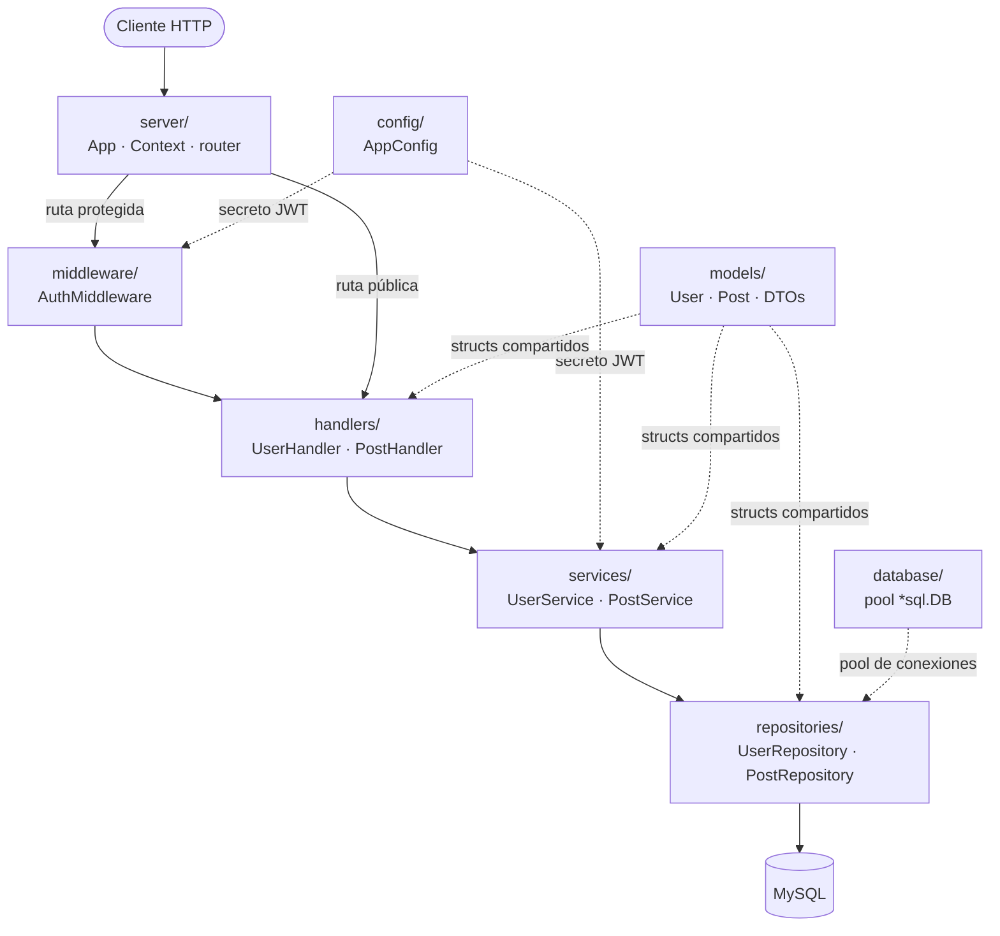
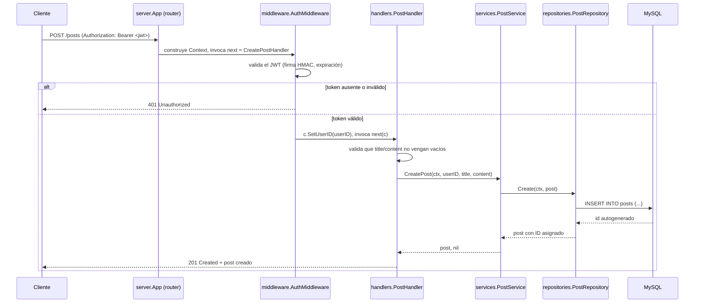
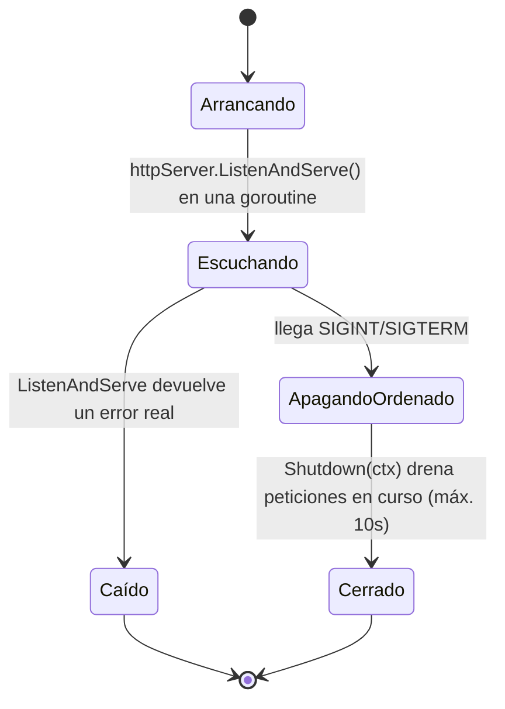
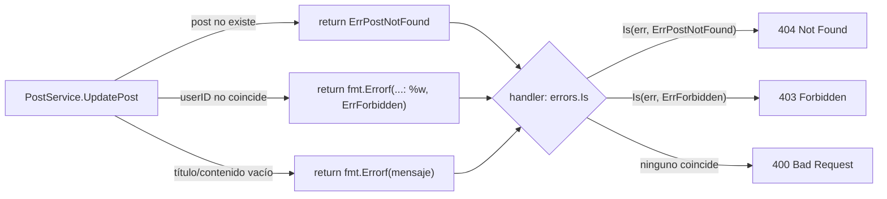

# Bitácora de desarrollo — GoPost API REST

Esto no es un manual de referencia (para eso está el [`README.md`](../README.md)) ni un recorrido guiado por código ya terminado (para eso está [`GUIA_DE_DESARROLLO.md`](../GUIA_DE_DESARROLLO.md), que explica el proyecto en orden de dependencias, de abajo hacia arriba). Esto es una **bitácora**: contamos, en primera persona y en el orden real en que fuimos escribiendo los archivos, cómo construimos GoPost API — qué teníamos antes de cada paso, qué decidimos añadir, y qué se nos escapó la primera vez y tuvimos que corregir después.

## Índice

1. [Qué construimos y por qué](#1-qué-construimos-y-por-qué)
2. [Stack tecnológico: las decisiones que tomamos](#2-stack-tecnológico-las-decisiones-que-tomamos)
3. [Arquitectura: cómo quedaron conectadas las piezas](#3-arquitectura-cómo-quedaron-conectadas-las-piezas)
4. [Árbol de carpetas final](#4-árbol-de-carpetas-final)
5. [Construcción paso a paso](#5-construcción-paso-a-paso)
   - [5.1 Arrancamos el módulo y elegimos las dependencias](#51-arrancamos-el-módulo-y-elegimos-las-dependencias)
   - [5.2 Diseñamos el esquema de datos antes de escribir Go](#52-diseñamos-el-esquema-de-datos-antes-de-escribir-go)
   - [5.3 Levantamos un servidor mínimo que respondiera algo](#53-levantamos-un-servidor-mínimo-que-respondiera-algo)
   - [5.4 Sacamos la configuración a `.env`](#54-sacamos-la-configuración-a-env)
   - [5.5 Conectamos MySQL](#55-conectamos-mysql)
   - [5.6 Definimos los modelos de dominio](#56-definimos-los-modelos-de-dominio)
   - [5.7 Escribimos los repositorios](#57-escribimos-los-repositorios)
   - [5.8 Escribimos el servicio de usuarios (auth)](#58-escribimos-el-servicio-de-usuarios-auth)
   - [5.9 Escribimos el servicio de posts](#59-escribimos-el-servicio-de-posts)
   - [5.10 Escribimos los handlers](#510-escribimos-los-handlers)
   - [5.11 Escribimos el middleware de autenticación](#511-escribimos-el-middleware-de-autenticación)
   - [5.12 Conectamos todo en `main.go`](#512-conectamos-todo-en-maingo)
   - [5.13 Volvimos sobre `PostService`: de strings a errores sentinela](#513-volvimos-sobre-postservice-de-strings-a-errores-sentinela)
   - [5.14 Endurecimos el servidor: timeouts y graceful shutdown](#514-endurecimos-el-servidor-timeouts-y-graceful-shutdown)
6. [Cómo levantar el proyecto hoy](#6-cómo-levantar-el-proyecto-hoy)
7. [Patrones aplicados vs. pendientes](#7-patrones-aplicados-vs-pendientes)
8. [Buenas prácticas: aplicadas y faltantes](#8-buenas-prácticas-aplicadas-y-faltantes)
9. [Seguridad: medidas, riesgos abiertos y recomendaciones](#9-seguridad-medidas-riesgos-abiertos-y-recomendaciones)
10. [Testing: qué existe hoy (y sus límites reales)](#10-testing-qué-existe-hoy-y-sus-límites-reales)
11. [Roadmap / pendientes](#11-roadmap--pendientes)
12. [Referencias](#12-referencias)

---

## 1. Qué construimos y por qué

Construimos una API REST en Go para gestionar **usuarios** y **posts**, con registro, login, JWT y un CRUD de posts donde solo el autor de un post puede editarlo o borrarlo. El objetivo no era resolverlo con el mínimo código posible, sino practicar cómo se estructura una aplicación Go de tamaño mediano en capas bien delimitadas — y hacerlo sin apoyarnos en un framework web, escribiendo nosotros mismos el enrutamiento sobre la librería estándar, para entender qué hace realmente un framework como Gin o Fiber por debajo.

Alcance que nos propusimos:

- Registro y login de usuarios, con contraseñas hasheadas y sesiones sin estado vía JWT.
- CRUD de posts, con lectura pública (cualquiera puede ver los posts de cualquiera) y escritura protegida (solo el dueño de un post puede modificarlo o borrarlo).
- Una API HTTP "de verdad": códigos de estado correctos, formato de error uniforme, sin fugas de información sensible.

Lo que dejamos fuera **a propósito**, no por olvido:

- **Tests automatizados.** No existen todavía (ver [sección 10](#10-testing-qué-existe-hoy-y-sus-límites-reales)); los repositorios dependen de `*sql.DB` concreto, no de interfaces, así que testear un servicio hoy exigiría una base de datos real.
- **Paginación.** `GetAllPosts`/`GetPostsByUserID` traen la tabla completa. Aceptable para un proyecto de aprendizaje con pocos datos, no para producción.
- **Rate limiting y CORS.** No hay protección contra fuerza bruta en `/login` ni configuración de orígenes cruzados — todavía no había un frontend real ni un caso de abuso que nos obligara a resolverlo.
- **Migraciones de base de datos.** `schema.sql` es un `DROP` + `CREATE` pensado para desarrollo local, no para versionar cambios incrementales en producción.

Estas ausencias no son un descuido silencioso: están documentadas también en el [`README.md`](../README.md#-próximas-mejoras) y retomadas con más detalle en la [sección 11](#11-roadmap--pendientes) de esta bitácora.

## 2. Stack tecnológico: las decisiones que tomamos

| Componente | Elegimos | Por qué |
|---|---|---|
| Lenguaje | Go 1.25 | Tipado estático, compila a un binario único, concurrencia nativa — y queríamos practicar Go, no evaluar lenguajes. |
| Router HTTP | `net/http.ServeMux` (sin librería externa) | Desde Go 1.22 el mux estándar acepta patrones con verbo y comodines de segmento (`"GET /posts/{id}"`, `r.PathValue("id")`). Antes eso era la razón principal para instalar `gorilla/mux` o similar; decidimos comprobar que ya no hacía falta y construir nuestro propio envoltorio mínimo (`server/`) en vez de sumar una dependencia. |
| Base de datos | MySQL 8 vía `database/sql` + `go-sql-driver/mysql` | Driver maduro y ampliamente usado; `database/sql` ya da pool de conexiones y *prepared statements* sin necesidad de un ORM completo. |
| Autenticación | JWT (`golang-jwt/jwt/v5`) | Queríamos sesiones *stateless*: el servidor no guarda nada en memoria ni en base de datos sobre quién está logueado, así que escalar a varias instancias no exige *sticky sessions* ni un almacén de sesiones compartido. |
| Hashing de contraseñas | `golang.org/x/crypto/bcrypt` | Es lento a propósito (resiste fuerza bruta) e incluye salt automáticamente; no había razón para implementar nada propio aquí. |
| Configuración | `.env` vía `joho/godotenv` | La configuración vive en variables de entorno, no hardcodeada ni versionada — así el mismo binario sirve para desarrollo local y para cualquier entorno donde se inyecten variables distintas. |

Decidimos esto **antes** de escribir la primera línea de Go: elegir el stack fue el paso 0, no algo que fuimos improvisando archivo a archivo.

## 3. Arquitectura: cómo quedaron conectadas las piezas

Terminamos con una **arquitectura en capas**: cada capa solo llama a la capa inmediatamente inferior. Un handler nunca ejecuta SQL, y un repositorio nunca sabe qué es un `http.Request`. Esto no lo teníamos planeado con un diagrama desde el día uno — fue emergiendo a medida que separamos responsabilidades (ver [sección 5](#5-construcción-paso-a-paso)), pero así es como quedó una vez que las piezas estuvieron todas en su sitio:



`main.go` no aparece en el diagrama de flujo de una petición porque no participa de ninguna: corre una única vez al arrancar el proceso, construye la cadena `repository → service → handler` para cada recurso y registra esos handlers en `server`; después queda bloqueado dentro de `server.RunServer(...)` hasta que llega una señal de apagado (ver [5.14](#514-endurecimos-el-servidor-timeouts-y-graceful-shutdown)).

El flujo completo de una petición protegida, como `POST /posts`, en secuencia:



Y el ciclo de vida del propio servidor HTTP, una vez que arranca, como diagrama de estados (esto lo añadimos en el último paso de la bitácora, [5.14](#514-endurecimos-el-servidor-timeouts-y-graceful-shutdown), cuando decidimos manejar el apagado de forma ordenada):



**Regla de dependencia que respetamos:** ninguna capa inferior importa a una superior. `repositories` no sabe que `services` existe, y `server` no sabe que existen "posts" o "usuarios" — por eso `server/` es, en teoría, reutilizable en cualquier otra API que quisiéramos construir sobre el mismo esqueleto.

## 4. Árbol de carpetas final

Así quedó la estructura una vez terminados todos los pasos de la [sección 5](#5-construcción-paso-a-paso). Cada carpeta se referencia por su nombre en el resto de este documento, así que quien lea sabe siempre dónde vive cada pieza:

```
go-user-posts-api/
├── config/
│   └── config.go              # Carga .env y expone config.AppConfig
├── database/
│   ├── database.go            # Pool *sql.DB (Connect/Close)
│   └── schema.sql             # DDL de las tablas users/posts
├── docs/
│   └── GUIA_DESARROLLO.md     # Este documento
├── handlers/
│   ├── post_handler.go        # Controladores HTTP de /posts
│   └── user_handler.go        # Controladores HTTP de /signup /login /me
├── middleware/
│   └── auth.go                # AuthMiddleware (valida JWT)
├── models/
│   ├── post.go                # struct Post
│   └── user.go                # struct User + DTOs SignUpInput/LoginInput
├── repositories/
│   ├── post_repository.go     # SQL de la tabla posts
│   └── user_repository.go     # SQL de la tabla users
├── server/
│   ├── context.go             # struct Context (envuelve cada petición)
│   ├── errors.go              # AppError / RespondError (formato de error uniforme)
│   ├── router.go              # App.Get/Post/Put/Delete
│   └── server.go              # App, NewApp, RunServer (arranque + shutdown)
├── services/
│   ├── post_service.go        # Reglas de negocio de posts + errores sentinela
│   └── user_service.go        # Validación, bcrypt, JWT
├── main.go                    # Composición raíz: cablea todo y registra rutas
├── go.mod / go.sum            # Módulo y dependencias
├── .env.example                # Plantilla de variables de entorno
├── database/schema.sql
├── GoPost-API.postman_collection.json  # Colección para probar la API a mano
├── README.md                  # Referencia de la API (endpoints, instalación)
├── CLAUDE.md                  # Guía de arquitectura para agentes de IA
└── GUIA_DE_DESARROLLO.md      # Tutorial de referencia (orden de dependencias)
```

## 5. Construcción paso a paso

### 5.1 Arrancamos el módulo y elegimos las dependencias

Lo primero, antes de cualquier lógica: inicializamos el módulo y bajamos las cuatro dependencias que ya habíamos decidido en la [sección 2](#2-stack-tecnológico-las-decisiones-que-tomamos).

```bash
go mod init github.com/alexroel/gopost-api

go get github.com/go-sql-driver/mysql
go get github.com/golang-jwt/jwt/v5
go get github.com/joho/godotenv
go get golang.org/x/crypto
```

📘 **Concepto de Go:** `go.mod` fija el *module path* (`github.com/alexroel/gopost-api`), que es a la vez el prefijo de import que usa el resto del código (`"github.com/alexroel/gopost-api/config"`, etc.) y, por convención, la URL donde viviría el repositorio si se publicara. `go get` añade cada dependencia a `require` con la versión resuelta y actualiza `go.sum` con los hashes de verificación — no hace falta editar `go.mod` a mano.

**Así quedó `go.mod` completo:**

```go
module github.com/alexroel/gopost-api

go 1.25.5

require (
	github.com/go-sql-driver/mysql v1.9.3
	github.com/golang-jwt/jwt/v5 v5.3.0
	github.com/joho/godotenv v1.5.1
	golang.org/x/crypto v0.46.0
)

require filippo.io/edwards25519 v1.1.0 // indirect
```

`filippo.io/edwards25519` no lo pedimos nosotros: es una dependencia transitiva del driver de MySQL (la usa para el método de autenticación `caching_sha2_password`), por eso Go la marca `// indirect`.

### 5.2 Diseñamos el esquema de datos antes de escribir Go

Antes de tocar un `.go`, decidimos el modelo de datos: dos tablas, relación 1 a N (un usuario escribe muchos posts).

```sql
CREATE TABLE posts (
    id INTEGER AUTO_INCREMENT PRIMARY KEY,
    user_id INTEGER NOT NULL,
    title VARCHAR(200) NOT NULL,
    content TEXT NOT NULL,
    created_at TIMESTAMP DEFAULT CURRENT_TIMESTAMP,
    updated_at TIMESTAMP DEFAULT CURRENT_TIMESTAMP ON UPDATE CURRENT_TIMESTAMP,
    FOREIGN KEY (user_id) REFERENCES users(id) ON DELETE CASCADE
);
```

Tres decisiones que tomamos aquí y que se sienten más adelante en el código Go:

- `email UNIQUE` en `users`: empujamos la restricción de unicidad hasta la base de datos como última línea de defensa, aunque también la validamos en `UserService.SignUp` antes de insertar (defensa en profundidad, ver [5.8](#58-escribimos-el-servicio-de-usuarios-auth)).
- `ON DELETE CASCADE` en la *foreign key* de `posts.user_id`: si se borra un usuario, sus posts se van con él, sin que tengamos que escribir esa limpieza a mano en Go.
- `updated_at ... ON UPDATE CURRENT_TIMESTAMP`: MySQL actualiza esa columna solo, sin que el repositorio tenga que fijarla en cada `UPDATE`.

⚠️ **Nota de la bitácora:** `password VARCHAR(100)` alcanza de sobra para un hash bcrypt (mide 60 caracteres siempre), pero el `DROP TABLE ... CASCADE + CREATE TABLE` de este script es destructivo — sirve para desarrollo local, nunca para aplicar sobre una base con datos reales. Lo dejamos así a propósito por ahora (ver [sección 11](#11-roadmap--pendientes)).

**Así quedó `database/schema.sql` completo:**

```sql
DROP TABLE IF EXISTS posts CASCADE;
DROP TABLE IF EXISTS users CASCADE;


CREATE TABLE users (
    id INTEGER AUTO_INCREMENT PRIMARY KEY,
    name VARCHAR(100) NOT NULL,
    email VARCHAR(100) UNIQUE NOT NULL,
    password VARCHAR(100) NOT NULL
); 

CREATE TABLE posts (
    id INTEGER AUTO_INCREMENT PRIMARY KEY,
    user_id INTEGER NOT NULL,
    title VARCHAR(200) NOT NULL,
    content TEXT NOT NULL,
    created_at TIMESTAMP DEFAULT CURRENT_TIMESTAMP,
    updated_at TIMESTAMP DEFAULT CURRENT_TIMESTAMP ON UPDATE CURRENT_TIMESTAMP,
    FOREIGN KEY (user_id) REFERENCES users(id) ON DELETE CASCADE
);
```

### 5.3 Levantamos un servidor mínimo que respondiera algo

Con el módulo listo, lo siguiente que quisimos fue ver **algo corriendo** cuanto antes, aunque fuera un servidor vacío — no esperamos a tener base de datos ni modelos para eso. Empezamos por `server/`, nuestro envoltorio propio sobre `net/http.ServeMux`.

Primero, el objeto que viaja con cada petición, en `server/context.go`:

```go
type Context struct {
	RWriter http.ResponseWriter
	Request *http.Request
	Cxt     context.Context
	userID  uint
}

func (c *Context) JSON(code int, data interface{}) error {
	c.RWriter.Header().Set("Content-Type", "application/json")
	c.RWriter.WriteHeader(code)
	return json.NewEncoder(c.RWriter).Encode(data)
}
```

📘 **Concepto de Go:** dejamos `userID` como campo **no exportado** (minúscula) a propósito. Solo puede escribirse desde dentro del paquete `server`, a través del método `SetUserID`. Eso nos permitió, más adelante, garantizar que la única forma legítima de fijar un `userID` en el `Context` fuera pasando por `AuthMiddleware` después de validar el JWT — ningún handler puede fijarlo a partir de datos sin verificar, porque el compilador no lo deja.

Después, el router: cuatro métodos casi idénticos, uno por verbo HTTP, en `server/router.go`:

```go
type HandleFunc func(c *Context)

func (app *App) Get(path string, handler func(*Context)) {
	app.mux.HandleFunc("GET "+path, func(w http.ResponseWriter, r *http.Request) {
		handler(&Context{
			RWriter: w,
			Request: r,
			Cxt:     r.Context(),
		})
	})

	app.handlerCount++
}
```

📘 **Concepto de Go:** `"GET "+path` no es un truco propio — es la sintaxis de patrones que `http.ServeMux` entiende de forma nativa desde Go 1.22 (`"GET /posts/{id}"`). Antes de esa versión, el mux estándar no distinguía verbos HTTP ni tenía comodines de segmento, y ese vacío era la razón principal por la que casi todo proyecto Go instalaba un router de terceros. Comprobar que ya no hacía falta fue justamente lo que nos animó a escribir `server/` en vez de sumar una dependencia como `gorilla/mux` o `chi`.

Y el propio `App`, en `server/server.go` (en este primer paso, sin timeouts ni apagado ordenado todavía — eso lo añadimos recién en [5.14](#514-endurecimos-el-servidor-timeouts-y-graceful-shutdown)):

```go
type App struct {
	mux          *http.ServeMux
	handlerCount int
}

func NewApp() *App {
	return &App{
		mux:          http.NewServeMux(),
		handlerCount: 0,
	}
}
```

Con esas tres piezas mínimas pudimos escribir un `main.go` de prueba con una sola ruta (`GET /health`) y confirmar que el servidor realmente arrancaba y respondía antes de invertir tiempo en base de datos o autenticación.

Por último, para que los errores tuvieran un formato uniforme desde el principio (y no tener que rehacer cada handler más tarde), añadimos `server/errors.go`:

```go
type AppError struct {
	Message string
	Code    int
}

func RespondError(c *Context, appErr *AppError) {
	c.JSON(appErr.Code, ErrorResponse{
		Error:   http.StatusText(appErr.Code),
		Message: appErr.Message,
		Code:    appErr.Code,
	})
}
```

⚠️ **Nota de la bitácora:** decidimos poner `AppError`/`RespondError` en `server` y no en `handlers`, aunque en ese momento todavía no existía `middleware/`. La razón se hizo evidente después: cuando escribimos `AuthMiddleware` ([5.11](#511-escribimos-el-middleware-de-autenticación)), este también necesita devolver errores HTTP con el mismo formato, y si `AppError` viviera en `handlers`, `middleware` tendría que importar `handlers` para usarlo — una dependencia cruzada rara, porque conceptualmente el middleware se ejecuta *antes* que el handler. Adelantarnos a eso y ponerlo en `server` (paquete del que ambos ya dependían) nos ahorró un refactor más tarde.

**Así quedó `server/context.go` completo:**

```go
package server

import (
	"context"
	"encoding/json"
	"net/http"
)

// Context envuelve una petición HTTP individual y se pasa a cada HandleFunc
// registrado en App. userID queda deliberadamente sin exportar: solo se
// puede escribir mediante SetUserID (llamado por AuthMiddleware tras validar
// el JWT), evitando que un handler la fije por error a partir de datos no
// verificados.
type Context struct {
	RWriter http.ResponseWriter
	Request *http.Request
	Cxt     context.Context
	userID  uint
}

// Send escribe text tal cual en el cuerpo de la respuesta, sin fijar
// Content-Type ni código de estado (usa el 200 por defecto de net/http).
func (c *Context) Send(text string) {
	c.RWriter.Write([]byte(text))
}

// Status escribe únicamente el código de estado HTTP. Como con cualquier
// http.ResponseWriter, debe llamarse antes de escribir el cuerpo: una vez
// enviado un byte, net/http fija el código en 200 de forma implícita y ya
// no puede cambiarse.
func (c *Context) Status(code int) {
	c.RWriter.WriteHeader(code)
}

// JSON serializa data como JSON y lo escribe en la respuesta con el código
// indicado.
//
// El código de estado se escribe antes de codificar el body, así que si
// json.Encode falla a mitad de la escritura (p. ej. un tipo no serializable)
// el cliente ya recibió el header con code y no hay forma de corregirlo:
// el error devuelto solo sirve para logging, no para reintentar la respuesta.
func (c *Context) JSON(code int, data interface{}) error {
	c.RWriter.Header().Set("Content-Type", "application/json")
	c.RWriter.WriteHeader(code)
	return json.NewEncoder(c.RWriter).Encode(data)
}

// BindJSON decodifica el cuerpo JSON de la petición en dest (debe ser un
// puntero). No cierra el body; net/http lo hace automáticamente al finalizar
// el handler.
func (c *Context) BindJSON(dest interface{}) error {
	return json.NewDecoder(c.Request.Body).Decode(dest)
}

// SetUserID asocia el ID del usuario autenticado a esta petición. Pensado
// para ser invocado únicamente por AuthMiddleware tras validar el JWT.
func (c *Context) SetUserID(id uint) {
	c.userID = id
}

// GetUserID devuelve el ID del usuario autenticado, o 0 si SetUserID nunca
// se llamó (rutas públicas, sin AuthMiddleware). Los handlers protegidos no
// necesitan validar este caso porque siempre están envueltos en
// AuthMiddleware, que ya rechaza la petición sin un token válido.
func (c *Context) GetUserID() uint {
	return c.userID
}

// Context devuelve el context.Context de la petición HTTP subyacente, para
// propagar cancelación/deadline a llamadas a la base de datos u otras
// operaciones sensibles al contexto.
func (c *Context) Context() context.Context {
	return c.Cxt
}
```

**Así quedó `server/router.go` completo:**

```go
package server

import "net/http"

// HandleFunc es la firma que deben cumplir los handlers registrados en App.
// Existe como alias del literal func(*Context) para que middleware como
// AuthMiddleware pueda expresar su firma "decorator" (HandleFunc -> HandleFunc)
// sin repetir el tipo función completo.
type HandleFunc func(c *Context)

// Get registra handler para peticiones GET en path. path sigue la sintaxis
// de patrones de http.ServeMux (Go 1.22+), incluyendo comodines de segmento
// como "/posts/{id}" recuperables luego con Request.PathValue("id").
func (app *App) Get(path string, handler func(*Context)) {
	app.mux.HandleFunc("GET "+path, func(w http.ResponseWriter, r *http.Request) {
		handler(&Context{
			RWriter: w,
			Request: r,
			Cxt:     r.Context(),
		})
	})

	app.handlerCount++
}

// Post registra handler para peticiones POST en path. Ver Get para la
// sintaxis de path.
func (app *App) Post(path string, handler func(*Context)) {
	app.mux.HandleFunc("POST "+path, func(w http.ResponseWriter, r *http.Request) {
		handler(&Context{
			RWriter: w,
			Request: r,
			Cxt:     r.Context(),
		})
	})

	app.handlerCount++
}

// Put registra handler para peticiones PUT en path. Ver Get para la
// sintaxis de path.
func (app *App) Put(path string, handler func(*Context)) {
	app.mux.HandleFunc("PUT "+path, func(w http.ResponseWriter, r *http.Request) {
		handler(&Context{
			RWriter: w,
			Request: r,
			Cxt:     r.Context(),
		})
	})

	app.handlerCount++
}

// Delete registra handler para peticiones DELETE en path. Ver Get para la
// sintaxis de path.
func (app *App) Delete(path string, handler func(*Context)) {
	app.mux.HandleFunc("DELETE "+path, func(w http.ResponseWriter, r *http.Request) {
		handler(&Context{
			RWriter: w,
			Request: r,
			Cxt:     r.Context(),
		})
	})

	app.handlerCount++
}
```

**Así quedó `server/errors.go` completo:**

```go
package server

import "net/http"

// ErrorResponse es el formato JSON uniforme para toda respuesta de error
// de la API.
type ErrorResponse struct {
	Error   string `json:"error"`
	Message string `json:"message"`
	Code    int    `json:"code"`
}

// AppError adjunta un código de estado HTTP a un mensaje de error, para que
// RespondError sepa con qué status responder. Handlers y middleware la usan
// como wrapper en el borde HTTP; los errores de dominio (services) siguen
// siendo errors/fmt.Errorf planos y cada llamador decide a qué AppError
// mapearlos.
//
// Vive en server (no en handlers) para que middleware pueda construir
// respuestas de error sin depender del paquete handlers.
type AppError struct {
	Message string
	Code    int
}

// Error implementa la interfaz error.
func (e *AppError) Error() string {
	return e.Message
}

// NewAppError construye un AppError con el mensaje y código HTTP dados.
func NewAppError(message string, code int) *AppError {
	return &AppError{
		Message: message,
		Code:    code,
	}
}

// RespondError escribe appErr como ErrorResponse en el código de estado
// indicado. El campo Error se deriva de http.StatusText(appErr.Code), así
// que un Code que no sea un status HTTP estándar producirá un Error vacío.
func RespondError(c *Context, appErr *AppError) {
	c.JSON(appErr.Code, ErrorResponse{
		Error:   http.StatusText(appErr.Code),
		Message: appErr.Message,
		Code:    appErr.Code,
	})
}
```

`server/server.go` todavía no tiene su forma final en este punto de la bitácora — el `App`/`NewApp` de arriba es la versión que escribimos aquí; `RunServer` con timeouts y apagado ordenado se muestra completo recién en [5.14](#514-endurecimos-el-servidor-timeouts-y-graceful-shutdown), que es cuando realmente lo escribimos.

### 5.4 Sacamos la configuración a `.env`

Con el servidor mínimo respondiendo, lo primero que nos molestó fue tener el puerto hardcodeado en el `main.go` de prueba. Antes de seguir sumando piezas, escribimos `config/config.go`.

```go
func LoadConfig() *Config {
	err := godotenv.Load(".env")
	if err != nil {
		log.Println("No se encontró archivo .env")
	}

	jwtSecret := getEnv("JWT_SECRET", "")
	if jwtSecret == "" {
		log.Fatal("JWT_SECRET es requerido. Por favor configura esta variable de entorno.")
	}

	AppConfig = &Config{
		Port:        getEnv("PORT", ":5050"),
		JWTSecret:   jwtSecret,
		DatabaseURL: getEnv("DATABASE_URL", "root:password@tcp(localhost:3306)/gopost"),
	}
	return AppConfig
}
```

⚠️ **Nota de la bitácora:** decidimos que `JWT_SECRET` no tuviera valor por defecto y que su ausencia matara el proceso con `log.Fatal` en vez de arrancar igual con un secreto vacío o inventado. No existe un valor "razonable" para firmar tokens si nadie lo configuró — preferimos que el servidor ni siquiera arranque a que arranque firmando tokens con una clave predecible.

`AppConfig` quedó como una variable de paquete (patrón *singleton simple*) en vez de pasarse por parámetro a cada componente que la necesita. Es la forma más rápida de compartir el secreto JWT entre `middleware` y `services`, pero tiene un costo que anotamos para después: cualquier código que lea `config.AppConfig` asume implícitamente que `LoadConfig()` ya corrió antes, y no se puede inyectar una configuración distinta en un test sin tocar estado global (retomado en [sección 11](#11-roadmap--pendientes)).

**Así quedó `config/config.go` completo:**

```go
package config

import (
	"log"
	"os"

	"github.com/joho/godotenv"
)

// Config agrupa los valores de configuración de la aplicación,
// cargados desde variables de entorno (ver LoadConfig).
type Config struct {
	Port        string
	JWTSecret   string
	DatabaseURL string
}

// AppConfig es la instancia global de configuración, poblada por LoadConfig.
// Es nil hasta que LoadConfig se ejecuta; otros paquetes (middleware, services)
// la leen directamente, así que LoadConfig debe llamarse una única vez al
// inicio de main antes de construir cualquier componente que dependa de ella.
var AppConfig *Config

// LoadConfig lee el archivo .env (si existe) y las variables de entorno,
// y devuelve la configuración resultante en AppConfig.
//
// Termina el proceso con log.Fatal si JWT_SECRET no está definido, ya que
// no existe un valor por defecto seguro para firmar tokens. Por esta razón
// no debe invocarse desde tests unitarios sin definir antes esa variable.
func LoadConfig() *Config {
	err := godotenv.Load(".env")
	if err != nil {
		log.Println("No se encontró archivo .env")
	}

	jwtSecret := getEnv("JWT_SECRET", "")
	if jwtSecret == "" {
		log.Fatal("JWT_SECRET es requerido. Por favor configura esta variable de entorno.")
	}

	AppConfig = &Config{
		Port:        getEnv("PORT", ":5050"),
		JWTSecret:   jwtSecret,
		DatabaseURL: getEnv("DATABASE_URL", "root:password@tcp(localhost:3306)/gopost"),
	}
	return AppConfig
}

func getEnv(key, defaultValue string) string {
	value := os.Getenv(key)
	if value == "" {
		return defaultValue
	}
	return value
}
```

Junto con este archivo escribimos la plantilla que documenta qué variables hacen falta, sin comprometer valores reales:

**Así quedó `.env.example` completo:**

```env
# Puerto del servidor
PORT=:5050

# Clave secreta para JWT (REQUERIDO)
# Genera una segura con: openssl rand -base64 32
JWT_SECRET=tu_secreto_super_seguro_aqui_minimo_32_caracteres

# URL de conexión a MySQL
# Formato: usuario:contraseña@tcp(host:puerto)/nombre_base_datos
DATABASE_URL=root:password@tcp(localhost:3306)/gopost
```

### 5.5 Conectamos MySQL

Con la configuración lista, tocaba abrir el pool de conexiones. Escribimos `database/database.go` como un paquete pequeño y separado de `repositories`, para que este último solo dependiera de un `*sql.DB` ya conectado, sin saber cómo se construyó.

```go
func Connect(dsn string) error {
	var err error

	DB, err = sql.Open("mysql", dsn)
	if err != nil {
		return fmt.Errorf("error al abrir la conexión: %w", err)
	}

	err = DB.Ping()
	if err != nil {
		return fmt.Errorf("error al conectar a la base de datos: %w", err)
	}

	DB.SetMaxOpenConns(25)
	DB.SetMaxIdleConns(10)

	return nil
}
```

📘 **Concepto de Go:** `sql.Open` **no** abre ninguna conexión real por sí sola — solo valida el formato del DSN y deja el pool preparado de forma perezosa. La primera vez que nos topamos con esto nos generó dudas: si escribíamos mal la contraseña de MySQL, `Connect` igual devolvía `nil` sin el `Ping()`. Por eso el `Ping()` explícito es imprescindible: es lo que fuerza una conexión real y detecta credenciales u host inválidos al arrancar, en vez de que el primer error aparezca recién con la primera petición HTTP ya en producción.

También notamos el `_ "github.com/go-sql-driver/mysql"` en los imports:

📘 **Concepto de Go:** el guion bajo antes del import es un *blank import*: no usamos ningún símbolo de ese paquete directamente en nuestro código, pero necesitamos que su función `init()` se ejecute, que es la que registra el driver `"mysql"` dentro de `database/sql`. Sin ese import, `sql.Open("mysql", ...)` fallaría en tiempo de ejecución con "unknown driver".

**Así quedó `database/database.go` completo:**

```go
package database

import (
	"database/sql"
	"fmt"

	_ "github.com/go-sql-driver/mysql"
)

// DB es el pool de conexiones global a MySQL, usado directamente por todos
// los repositorios. Permanece en nil hasta que Connect se ejecuta con éxito;
// no es seguro usarlo antes de eso.
var DB *sql.DB

// Connect abre el pool de conexiones a MySQL y verifica con Ping que la
// base de datos responde antes de devolver el control a main.
//
// sql.Open no abre ninguna conexión real por sí solo (solo valida el DSN);
// el Ping explícito es lo que detecta credenciales u host inválidos al
// arrancar, en vez de que el primer error aparezca recién en la primera
// petición HTTP.
func Connect(dsn string) error {
	var err error

	DB, err = sql.Open("mysql", dsn)
	if err != nil {
		return fmt.Errorf("error al abrir la conexión: %w", err)
	}

	err = DB.Ping()
	if err != nil {
		return fmt.Errorf("error al conectar a la base de datos: %w", err)
	}

	// Límites del pool para no agotar max_connections de MySQL; mantener
	// conexiones inactivas listas evita el costo de reabrir TCP+auth en
	// cada request.
	DB.SetMaxOpenConns(25)
	DB.SetMaxIdleConns(10)

	return nil
}

// Close libera el pool de conexiones. Es seguro llamarlo aunque Connect
// nunca se haya ejecutado (DB seguiría siendo nil).
func Close() error {
	if DB != nil {
		return DB.Close()
	}
	return nil
}
```

### 5.6 Definimos los modelos de dominio

Antes de escribir la primera consulta SQL necesitábamos los tipos que esa consulta iba a poblar. Escribimos `models/user.go` y `models/post.go` como structs planos, sin ningún comportamiento — solo datos y sus tags JSON.

```go
type User struct {
	ID       uint   `json:"id"`
	Name     string `json:"name"`
	Email    string `json:"email"`
	Password string `json:"-"`
}

type SignUpInput struct {
	Name     string `json:"name"`
	Email    string `json:"email"`
	Password string `json:"password"`
}
```

📘 **Concepto de Go:** el tag `json:"-"` en `Password` le dice al encoder de `encoding/json` que **nunca** serialice ese campo, pase lo que pase. Lo pusimos como red de seguridad a nivel de tipo: si algún día un handler pasara un `models.User` completo directamente a `c.JSON(...)` por error (en vez de armar un mapa con solo los campos públicos, como hacemos hoy en `MeHandler`), el hash de la contraseña seguiría sin poder salir en la respuesta.

`SignUpInput`/`LoginInput` los separamos de `User` a propósito: son el **DTO** (Data Transfer Object) que describe exactamente qué JSON esperamos en el body de `/signup`/`/login`. Si en vez de eso decodificáramos el JSON directo sobre `models.User`, un cliente podría, sin querer o queriendo, mandar un campo `"id"` en el body e intentar controlar el ID del usuario que se crea — el patrón clásico de *mass assignment*.

⚠️ **Nota de la bitácora:** en `models/post.go`, `CreatedAt`/`UpdatedAt` los definimos como `string`, no `time.Time`. No fue el tipo que hubiéramos elegido a mano — es una consecuencia de una decisión que tomamos en `database/database.go`: el driver de MySQL entrega las columnas `TIMESTAMP` como texto mientras el DSN no incluya `parseTime=true`, y no lo incluimos. Si en el futuro agregamos ese parámetro al DSN, el driver empezará a entregar `time.Time` y el `Scan` de estos campos en los repositorios ([5.7](#57-escribimos-los-repositorios)) fallará en tiempo de ejecución — hay que cambiar el tipo en ambos lados a la vez, no solo en el modelo.

**Así quedó `models/user.go` completo:**

```go
package models

// User representa un usuario registrado. Password guarda el hash bcrypt,
// nunca la contraseña en texto plano, y su tag `json:"-"` impide que se
// serialice aunque el struct completo se pase a Context.JSON por error.
type User struct {
	ID       uint   `json:"id"`
	Name     string `json:"name"`
	Email    string `json:"email"`
	Password string `json:"-"`
}

// SignUpInput es el cuerpo esperado en POST /signup.
type SignUpInput struct {
	Name     string `json:"name"`
	Email    string `json:"email"`
	Password string `json:"password"`
}

// LoginInput es el cuerpo esperado en POST /login.
type LoginInput struct {
	Email    string `json:"email"`
	Password string `json:"password"`
}
```

**Así quedó `models/post.go` completo:**

```go
package models

// Post representa una publicación de un usuario.
//
// CreatedAt/UpdatedAt son string, no time.Time, porque el driver MySQL
// devuelve las columnas TIMESTAMP como texto mientras el DSN no incluya
// parseTime=true (ver database/database.go). Si en el futuro se agrega ese
// parámetro al DSN, el driver empezará a entregar time.Time y el Scan de
// estos campos en los repositorios fallará en tiempo de ejecución: hay que
// cambiar el tipo aquí y en los repositorios a la vez.
type Post struct {
	ID        uint   `json:"id"`
	UserID    uint   `json:"user_id"`
	Title     string `json:"title"`
	Content   string `json:"content"`
	CreatedAt string `json:"created_at"`
	UpdatedAt string `json:"updated_at"`
}
```

### 5.7 Escribimos los repositorios

Con los modelos definidos, escribimos primero `repositories/user_repository.go` (lo necesitábamos para el registro/login) y después `repositories/post_repository.go`. Cada uno recibe un `*sql.DB` ya conectado por constructor y expone métodos con nombres de intención (`FindByEmail`, no "ejecuta este SELECT").

```go
func (r *UserRepository) FindByID(cxt context.Context, id uint) (*models.User, error) {
	user := &models.User{}
	query := "SELECT id, name, email FROM users WHERE id = ?"
	err := r.db.QueryRowContext(cxt, query, id).Scan(&user.ID, &user.Name, &user.Email)
	if err != nil {
		if err == sql.ErrNoRows {
			return nil, fmt.Errorf("usuario no encontrado")
		}

		return nil, fmt.Errorf("error al buscar usuario por ID: %w", err)
	}

	return user, nil
}
```

Reglas que aplicamos en los dos repositorios desde el principio:

1. **SQL parametrizado siempre** (`?` como placeholder, nunca concatenación de strings) — la defensa estándar contra inyección SQL. El driver envía los parámetros por separado de la consulta.
2. **Columnas explícitas, nunca `SELECT *`** — si alguien agrega una columna a la tabla más adelante, un `SELECT *` rompería silenciosamente el orden posicional del `Scan`.
3. **`UserRepository.FindByID` no trae `password`**, a diferencia de `FindByEmail`. `FindByID` alimenta `/me`, que nunca debería tener el hash en memoria; solo `FindByEmail` (usado en login) lo trae, porque ahí sí hace falta compararlo con bcrypt.
4. **Cada `Find*` traduce `sql.ErrNoRows`** a un error de dominio legible (`"post no encontrado"`, `"usuario no encontrado"`), en vez de dejar fugar el error crudo de `database/sql` hacia arriba.

⚠️ **Nota de la bitácora:** al escribir `PostRepository.Update` nos topamos con un comportamiento de MySQL que no esperábamos y que documentamos directamente en el código para no volver a caer en él: por defecto (sin el flag de protocolo `CLIENT_FOUND_ROWS`), MySQL reporta en `RowsAffected` las filas *modificadas*, no las que hicieron *match* en el `WHERE`. Eso significa que si un cliente reenvía el mismo título y contenido que ya tenía un post, MySQL devuelve `0` filas afectadas aunque el post exista y el `UPDATE` sea válido — y tal como está escrito hoy, `Update` interpreta ese `0` como "post no encontrado", lo cual es **incorrecto** en ese caso puntual. Lo dejamos anotado como una limitación conocida en vez de resolverlo con una consulta extra, porque el caso de uso real (reenviar exactamente el mismo contenido) es poco común; queda listado en la [sección 11](#11-roadmap--pendientes).

**Así quedó `repositories/user_repository.go` completo:**

```go
package repositories

import (
	"context"
	"database/sql"
	"fmt"

	"github.com/alexroel/gopost-api/models"
)

// UserRepository encapsula el acceso a la tabla users. No valida datos de
// negocio (formato de email, longitud de password, etc.): eso es
// responsabilidad de services.UserService.
type UserRepository struct {
	db *sql.DB
}

// NewUserRepository crea un UserRepository sobre un *sql.DB ya conectado
// (ver database.Connect).
func NewUserRepository(db *sql.DB) *UserRepository {
	return &UserRepository{db: db}
}

// Create inserta user y rellena user.ID con el ID autogenerado por MySQL.
// Asume que user.Password ya llega hasheado; este método no hashea nada.
func (r *UserRepository) Create(cxt context.Context, user *models.User) error {
	query := "INSERT INTO users (name, email, password) VALUES (?, ?, ?)"
	result, err := r.db.ExecContext(cxt, query, user.Name, user.Email, user.Password)
	if err != nil {
		return fmt.Errorf("error al crear usuario: %w", err)
	}

	id, err := result.LastInsertId()
	if err != nil {
		return fmt.Errorf("error al obtener el ID del usuario creado: %w", err)
	}

	user.ID = uint(id)
	return nil
}

// FindByID busca un usuario por ID. Deliberadamente no selecciona la
// columna password (a diferencia de FindByEmail): este método alimenta
// respuestas como /me, que nunca deben tener el hash en memoria.
func (r *UserRepository) FindByID(cxt context.Context, id uint) (*models.User, error) {
	user := &models.User{}
	query := "SELECT id, name, email FROM users WHERE id = ?"
	err := r.db.QueryRowContext(cxt, query, id).Scan(&user.ID, &user.Name, &user.Email)
	if err != nil {
		if err == sql.ErrNoRows {
			return nil, fmt.Errorf("usuario no encontrado")
		}

		return nil, fmt.Errorf("error al buscar usuario por ID: %w", err)
	}

	return user, nil
}

// FindByEmail busca un usuario por email, incluyendo el hash de password:
// es el único método pensado para el flujo de login
// (services.UserService.Login), donde se necesita para comparar con bcrypt.
func (r *UserRepository) FindByEmail(ctx context.Context, email string) (*models.User, error) {
	user := &models.User{}
	query := "SELECT id, name, email, password FROM users WHERE email = ?"

	err := r.db.QueryRowContext(ctx, query, email).Scan(&user.ID, &user.Name, &user.Email, &user.Password)
	if err != nil {
		if err == sql.ErrNoRows {
			return nil, fmt.Errorf("usuario no encontrado")
		}
		return nil, fmt.Errorf("error al buscar usuario: %w", err)
	}

	return user, nil
}

// EmailExists indica si ya existe un usuario con ese email. Se usa antes de
// Create para devolver un error de negocio claro en vez de depender del
// UNIQUE constraint de la tabla y tener que parsear el error del driver.
func (r *UserRepository) EmailExists(ctx context.Context, email string) (bool, error) {
	var count int
	query := "SELECT COUNT(*) FROM users WHERE email = ?"

	err := r.db.QueryRowContext(ctx, query, email).Scan(&count)
	if err != nil {
		return false, fmt.Errorf("error al verificar email: %w", err)
	}

	return count > 0, nil
}
```

**Así quedó `repositories/post_repository.go` completo:**

```go
package repositories

import (
	"context"
	"database/sql"
	"fmt"

	"github.com/alexroel/gopost-api/models"
)

// PostRepository encapsula el acceso a la tabla posts. No valida datos de
// negocio ni permisos (título/contenido vacíos, propiedad del post): eso es
// responsabilidad de services.PostService.
type PostRepository struct {
	db *sql.DB
}

// NewPostRepository crea un PostRepository sobre un *sql.DB ya conectado
// (ver database.Connect).
func NewPostRepository(db *sql.DB) *PostRepository {
	return &PostRepository{db: db}
}

// Create inserta post y rellena post.ID con el ID autogenerado por MySQL.
func (r *PostRepository) Create(ctx context.Context, post *models.Post) error {
	query := "INSERT INTO posts (user_id, title, content) VALUES (?, ?, ?)"
	result, err := r.db.ExecContext(ctx, query, post.UserID, post.Title, post.Content)
	if err != nil {
		return fmt.Errorf("error al crear post: %w", err)
	}

	id, err := result.LastInsertId()
	if err != nil {
		return fmt.Errorf("error al obtener ID: %w", err)
	}

	post.ID = uint(id)
	return nil
}

// FindAll devuelve todos los posts, más recientes primero. Sin paginación:
// en una tabla grande esto carga el resultado completo en memoria.
func (r *PostRepository) FindAll(ctx context.Context) ([]models.Post, error) {
	query := "SELECT id, user_id, title, content, created_at, updated_at FROM posts ORDER BY created_at DESC"
	rows, err := r.db.QueryContext(ctx, query)
	if err != nil {
		return nil, fmt.Errorf("error al obtener posts: %w", err)
	}
	defer rows.Close()

	var posts []models.Post
	for rows.Next() {
		var post models.Post
		if err := rows.Scan(&post.ID, &post.UserID, &post.Title,
			&post.Content, &post.CreatedAt, &post.UpdatedAt); err != nil {
			return nil, fmt.Errorf("error al escanear post: %w", err)
		}
		posts = append(posts, post)
	}

	return posts, nil
}

// FindByID busca un post por su ID.
func (r *PostRepository) FindByID(ctx context.Context, id uint) (*models.Post, error) {
	post := &models.Post{}
	query := "SELECT id, user_id, title, content, created_at, updated_at FROM posts WHERE id = ?"

	err := r.db.QueryRowContext(ctx, query, id).
		Scan(&post.ID, &post.UserID, &post.Title, &post.Content, &post.CreatedAt, &post.UpdatedAt)
	if err != nil {
		if err == sql.ErrNoRows {
			return nil, fmt.Errorf("post no encontrado")
		}
		return nil, fmt.Errorf("error al buscar post: %w", err)
	}

	return post, nil
}

// FindByUserID devuelve los posts de userID, más recientes primero. Igual
// que FindAll, no pagina el resultado.
func (r *PostRepository) FindByUserID(ctx context.Context, userID uint) ([]models.Post, error) {
	query := "SELECT id, user_id, title, content, created_at, updated_at FROM posts WHERE user_id = ? ORDER BY created_at DESC"
	rows, err := r.db.QueryContext(ctx, query, userID)
	if err != nil {
		return nil, fmt.Errorf("error al obtener posts del usuario: %w", err)
	}
	defer rows.Close()

	var posts []models.Post
	for rows.Next() {
		var post models.Post
		if err := rows.Scan(&post.ID, &post.UserID, &post.Title, &post.Content,
			&post.CreatedAt, &post.UpdatedAt); err != nil {
			return nil, fmt.Errorf("error al escanear post: %w", err)
		}
		posts = append(posts, post)
	}

	return posts, nil
}

// Update sobrescribe título y contenido de post.ID.
//
// GOTCHA: MySQL, por defecto (sin el flag de protocolo CLIENT_FOUND_ROWS),
// reporta en RowsAffected las filas realmente *modificadas*, no las filas
// que hicieron match en el WHERE. Si un cliente reenvía el mismo título y
// contenido que ya tenía el post, MySQL devuelve 0 filas afectadas aunque
// el post exista y el UPDATE haya sido válido, y este método responderá
// erróneamente "post no encontrado". El repositorio no puede distinguir ese
// caso de un ID inexistente sin una consulta adicional (o sin habilitar
// CLIENT_FOUND_ROWS en el DSN).
func (r *PostRepository) Update(ctx context.Context, post *models.Post) error {
	query := "UPDATE posts SET title = ?, content = ? WHERE id = ?"
	result, err := r.db.ExecContext(ctx, query, post.Title, post.Content, post.ID)
	if err != nil {
		return fmt.Errorf("error al actualizar post: %w", err)
	}

	rowsAffected, err := result.RowsAffected()
	if err != nil {
		return fmt.Errorf("error al verificar actualización: %w", err)
	}

	if rowsAffected == 0 {
		return fmt.Errorf("post no encontrado")
	}

	return nil
}

// Delete elimina el post con el id dado. A diferencia de Update, aquí
// RowsAffected sí refleja de forma fiable si la fila existía: un DELETE no
// tiene la ambigüedad "afectada vs. coincidente" propia del UPDATE.
func (r *PostRepository) Delete(ctx context.Context, id uint) error {
	query := "DELETE FROM posts WHERE id = ?"
	result, err := r.db.ExecContext(ctx, query, id)
	if err != nil {
		return fmt.Errorf("error al eliminar post: %w", err)
	}

	rowsAffected, err := result.RowsAffected()
	if err != nil {
		return fmt.Errorf("error al verificar eliminación: %w", err)
	}

	if rowsAffected == 0 {
		return fmt.Errorf("post no encontrado")
	}

	return nil
}
```

### 5.8 Escribimos el servicio de usuarios (auth)

Con los repositorios listos, escribimos `services/user_service.go`: validación de formato, hashing con bcrypt y emisión de JWT. Ningún servicio importa `net/http` — la idea era que, en teoría, se pudieran probar con datos en memoria sin levantar un servidor (aunque hoy no tenemos esos tests, ver [sección 10](#10-testing-qué-existe-hoy-y-sus-límites-reales)).

```go
func (s *UserService) SignUp(ctx context.Context, name, email, password string) (*models.User, error) {
	if err := ValidateEmail(email); err != nil {
		return nil, err
	}

	if err := ValidatePassword(password); err != nil {
		return nil, err
	}

	exists, err := s.repo.EmailExists(ctx, email)
	if err != nil {
		return nil, err
	}
	if exists {
		return nil, fmt.Errorf("el email ya está registrado")
	}

	hashedPassword, err := bcrypt.GenerateFromPassword([]byte(password), bcrypt.DefaultCost)
	if err != nil {
		return nil, fmt.Errorf("error al hashear la contraseña: %w", err)
	}
	// ...
}
```

El servicio recibe el repositorio por constructor (`NewUserService(repo)`), no lo crea internamente — es la forma más simple de *Dependency Injection*: quien construye el grafo de objetos (`main.go`, ver [5.12](#512-conectamos-todo-en-maingo)) decide qué implementación concreta usar.

Después escribimos `Login`, y ahí tomamos una decisión de seguridad deliberada:

```go
func (s *UserService) Login(ctx context.Context, email, password string) (string, error) {
	user, err := s.repo.FindByEmail(ctx, email)
	if err != nil {
		return "", fmt.Errorf("credenciales incorrectas")
	}

	err = bcrypt.CompareHashAndPassword([]byte(user.Password), []byte(password))
	if err != nil {
		return "", fmt.Errorf("credenciales incorrectas")
	}
	// ...
}
```

⚠️ **Nota de la bitácora:** la primera tentación fue devolver mensajes distintos ("email no encontrado" vs. "contraseña incorrecta"), porque son técnicamente casos diferentes. Los unificamos a propósito en `"credenciales incorrectas"` para los dos casos: si el mensaje distinguiera, un atacante podría enumerar qué emails están registrados en el sistema probando uno por uno (*user enumeration*), sin necesidad de acertar ninguna contraseña.

📘 **Concepto de Go:** `generateToken` depende de `config.AppConfig.JWTSecret` sin comprobar que `AppConfig` no sea `nil`. Si `config.LoadConfig()` no se hubiera ejecutado todavía, esta línea entraría en *panic* por *nil pointer dereference*. No pusimos un chequeo defensivo porque, en la práctica, `main.go` siempre llama a `LoadConfig()` como el primer paso antes de construir ningún servicio (ver [5.12](#512-conectamos-todo-en-maingo)) — el orden de construcción en el *composition root* es lo que garantiza esta invariante, no una validación en tiempo de ejecución.

**Así quedó `services/user_service.go` completo:**

```go
package services

import (
	"context"
	"fmt"
	"regexp"
	"time"

	"github.com/alexroel/gopost-api/config"
	"github.com/alexroel/gopost-api/models"
	"github.com/alexroel/gopost-api/repositories"
	"github.com/golang-jwt/jwt/v5"
	"golang.org/x/crypto/bcrypt"
)

// UserService contiene las reglas de negocio de usuarios: validación,
// hashing de contraseñas y emisión de JWT. Las queries SQL viven solo en
// repositories.UserRepository.
type UserService struct {
	repo *repositories.UserRepository
}

// NewUserService crea un UserService sobre repo.
func NewUserService(repo *repositories.UserRepository) *UserService {
	return &UserService{repo: repo}
}

// ValidateEmail valida que email tenga un formato sintácticamente correcto.
// No verifica que el dominio exista ni que la casilla sea entregable.
func ValidateEmail(email string) error {
	emailRegex := regexp.MustCompile(`^[a-zA-Z0-9._%+\-]+@[a-zA-Z0-9.\-]+\.[a-zA-Z]{2,}$`)
	if !emailRegex.MatchString(email) {
		return fmt.Errorf("formato de email inválido")
	}

	return nil
}

// ValidatePassword valida que la contraseña tenga al menos 6 caracteres
func ValidatePassword(password string) error {
	if len(password) < 6 {
		return fmt.Errorf("la contraseña debe tener al menos 6 caracteres")
	}
	return nil
}

// SignUp registra un nuevo usuario: valida email y contraseña, comprueba
// que el email no esté en uso, hashea la contraseña con bcrypt y persiste
// el usuario. El *models.User devuelto trae Password ya hasheado, nunca la
// contraseña original.
func (s *UserService) SignUp(ctx context.Context, name, email, password string) (*models.User, error) {
	if err := ValidateEmail(email); err != nil {
		return nil, err
	}

	if err := ValidatePassword(password); err != nil {
		return nil, err
	}

	exists, err := s.repo.EmailExists(ctx, email)
	if err != nil {
		return nil, err
	}
	if exists {
		return nil, fmt.Errorf("el email ya está registrado")
	}

	hashedPassword, err := bcrypt.GenerateFromPassword([]byte(password), bcrypt.DefaultCost)
	if err != nil {
		return nil, fmt.Errorf("error al hashear la contraseña: %w", err)
	}

	user := &models.User{
		Name:     name,
		Email:    email,
		Password: string(hashedPassword),
	}

	if err := s.repo.Create(ctx, user); err != nil {
		return nil, err
	}

	return user, nil
}

// generateToken firma un JWT HS256 con el claim user_id y expiración a 72h.
//
// Depende del singleton config.AppConfig, que debe estar poblado por
// config.LoadConfig antes de la primera llamada; si AppConfig es nil esto
// entra en panic por nil pointer dereference (no hay chequeo defensivo).
func (s *UserService) generateToken(userId uint) (string, error) {
	claims := jwt.MapClaims{
		"user_id": userId,
		"exp":     jwt.NewNumericDate(time.Now().Add(72 * time.Hour)),
	}

	token := jwt.NewWithClaims(jwt.SigningMethodHS256, claims)
	return token.SignedString([]byte(config.AppConfig.JWTSecret))
}

// Login valida credenciales contra la contraseña hasheada almacenada y, si
// coinciden, devuelve un JWT firmado. Los dos casos de fallo (email
// inexistente y contraseña incorrecta) devuelven el mismo mensaje genérico
// a propósito, para no revelar a un atacante si un email está registrado.
func (s *UserService) Login(ctx context.Context, email, password string) (string, error) {
	user, err := s.repo.FindByEmail(ctx, email)
	if err != nil {
		return "", fmt.Errorf("credenciales incorrectas")
	}

	err = bcrypt.CompareHashAndPassword([]byte(user.Password), []byte(password))
	if err != nil {
		return "", fmt.Errorf("credenciales incorrectas")
	}

	toke, err := s.generateToken(user.ID)
	if err != nil {
		return "", fmt.Errorf("error al generar el token: %w", err)
	}

	return toke, nil
}

// GetUserByID obtiene un usuario por su ID, delegando directamente en el
// repositorio (sin lógica de negocio adicional).
func (s *UserService) GetUserByID(ctx context.Context, id uint) (*models.User, error) {
	return s.repo.FindByID(ctx, id)
}
```

### 5.9 Escribimos el servicio de posts

Con el patrón ya probado en `UserService`, escribimos `services/post_service.go`. En esta primera versión, todos los errores eran `fmt.Errorf` planos, sin distinguir "no existe" de "no te pertenece" — ese refinamiento lo hicimos en un paso posterior ([5.13](#513-volvimos-sobre-postservice-de-strings-a-errores-sentinela)) al notar un problema real. Lo que mostramos aquí es la lógica de negocio ya con esa corrección aplicada, porque así quedó el archivo final:

```go
func (s *PostService) UpdatePost(ctx context.Context, postID, userID uint, title, content string) error {
	if title == "" {
		return fmt.Errorf("el título es requerido")
	}

	if content == "" {
		return fmt.Errorf("el contenido es requerido")
	}

	existingPost, err := s.repo.FindByID(ctx, postID)
	if err != nil {
		return ErrPostNotFound
	}

	if existingPost.UserID != userID {
		return fmt.Errorf("no tienes permiso para actualizar este post: %w", ErrForbidden)
	}
	// ...
}
```

**Autorización a nivel de servicio, no de middleware:** `AuthMiddleware` (que todavía no habíamos escrito en este punto, ver [5.11](#511-escribimos-el-middleware-de-autenticación)) solo verifica *quién* hace la petición. Verificar que ese usuario sea *dueño* del post que intenta modificar es una regla de negocio — por eso vive aquí, comparando `existingPost.UserID` contra el `userID` que llega como parámetro, no en el middleware.

**Así quedó `services/post_service.go` completo:**

```go
package services

import (
	"context"
	"errors"
	"fmt"

	"github.com/alexroel/gopost-api/models"
	"github.com/alexroel/gopost-api/repositories"
)

// Errores sentinela que permiten a los handlers distinguir, con errors.Is,
// entre "no encontrado" y "sin permiso" para mapearlos a 404/403 en vez de
// tratar todo error de PostService como un simple 400.
var (
	ErrPostNotFound = errors.New("post no encontrado")
	ErrForbidden    = errors.New("no tienes permiso para esta acción")
)

// PostService contiene las reglas de negocio de posts: validación de campos
// y verificación de que solo el autor de un post pueda modificarlo o
// eliminarlo. Las queries SQL viven solo en repositories.PostRepository.
type PostService struct {
	repo *repositories.PostRepository
}

// NewPostService crea un PostService sobre repo.
func NewPostService(repo *repositories.PostRepository) *PostService {
	return &PostService{repo: repo}
}

// CreatePost valida título y contenido y crea un post asociado a userID.
func (s *PostService) CreatePost(ctx context.Context, userID uint, title, content string) (*models.Post, error) {
	if title == "" {
		return nil, fmt.Errorf("el título es requerido")
	}

	if content == "" {
		return nil, fmt.Errorf("el contenido es requerido")
	}

	post := &models.Post{
		UserID:  userID,
		Title:   title,
		Content: content,
	}

	if err := s.repo.Create(ctx, post); err != nil {
		return nil, fmt.Errorf("error al crear el post: %w", err)
	}

	return post, nil
}

// GetAllPosts devuelve todos los posts existentes, sin filtrar por autor.
func (s *PostService) GetAllPosts(ctx context.Context) ([]models.Post, error) {
	posts, err := s.repo.FindAll(ctx)
	if err != nil {
		return nil, fmt.Errorf("error al obtener los posts: %w", err)
	}

	return posts, nil
}

// GetPostByID obtiene un post por su ID. No exige autenticación: el
// endpoint público GET /posts/{id} lo usa directamente.
func (s *PostService) GetPostByID(ctx context.Context, id uint) (*models.Post, error) {
	post, err := s.repo.FindByID(ctx, id)
	if err != nil {
		return nil, ErrPostNotFound
	}

	return post, nil
}

// GetPostsByUserID obtiene todos los posts de userID. Se reutiliza tanto
// para GET /posts/me (userID sacado del JWT) como para GET /users/{id}/posts
// (userID de la URL, ruta pública): la propia firma no distingue "mis
// posts" de "los posts de un tercero", esa decisión la toma el handler que
// llama a este método.
func (s *PostService) GetPostsByUserID(ctx context.Context, userID uint) ([]models.Post, error) {
	posts, err := s.repo.FindByUserID(ctx, userID)
	if err != nil {
		return nil, fmt.Errorf("error al obtener los posts del usuario: %w", err)
	}

	return posts, nil
}

// UpdatePost valida título y contenido, confirma que postID pertenece a
// userID (autorización a nivel de servicio, no de middleware) y persiste
// los cambios.
//
// Los errores de "no encontrado" y "sin permiso" envuelven ErrPostNotFound
// y ErrForbidden respectivamente, para que el handler los distinga con
// errors.Is y responda 404/403 en vez de un genérico 400.
func (s *PostService) UpdatePost(ctx context.Context, postID, userID uint, title, content string) error {
	if title == "" {
		return fmt.Errorf("el título es requerido")
	}

	if content == "" {
		return fmt.Errorf("el contenido es requerido")
	}

	existingPost, err := s.repo.FindByID(ctx, postID)
	if err != nil {
		return ErrPostNotFound
	}

	if existingPost.UserID != userID {
		return fmt.Errorf("no tienes permiso para actualizar este post: %w", ErrForbidden)
	}

	existingPost.Title = title
	existingPost.Content = content

	if err := s.repo.Update(ctx, existingPost); err != nil {
		return fmt.Errorf("error al actualizar el post: %w", err)
	}

	return nil
}

// DeletePost confirma que postID pertenece a userID (misma verificación de
// autorización y mismos errores sentinela que UpdatePost) y lo elimina.
func (s *PostService) DeletePost(ctx context.Context, postID, userID uint) error {
	existingPost, err := s.repo.FindByID(ctx, postID)
	if err != nil {
		return ErrPostNotFound
	}

	if existingPost.UserID != userID {
		return fmt.Errorf("no tienes permiso para eliminar este post: %w", ErrForbidden)
	}

	if err := s.repo.Delete(ctx, postID); err != nil {
		return fmt.Errorf("error al eliminar el post: %w", err)
	}

	return nil
}
```

### 5.10 Escribimos los handlers

Con los servicios listos, escribimos `handlers/user_handler.go` primero (registro/login/perfil) y después `handlers/post_handler.go`. Cada handler decodifica el request, hace una validación superficial (¿llegaron los campos?), llama al servicio y traduce el resultado a JSON.

```go
func (h *UserHandler) SignUpHandler(c *server.Context) {
	var req models.SignUpInput
	if err := c.BindJSON(&req); err != nil {
		server.RespondError(c, server.NewAppError("Datos inválidos", http.StatusBadRequest))
		return
	}

	if req.Name == "" || req.Email == "" || req.Password == "" {
		server.RespondError(c, server.NewAppError("Todos los campos son obligatorios", http.StatusBadRequest))
		return
	}

	user, err := h.userService.SignUp(c.Context(), req.Name, req.Email, req.Password)
	if err != nil {
		server.RespondError(c, server.NewAppError(err.Error(), http.StatusBadRequest))
		return
	}
	// ...
}
```

Notamos aquí un patrón que repetimos en todo handler de escritura: **validación superficial en el handler** (¿el JSON es válido?, ¿llegaron los campos?) y **validación de negocio en el servicio** (¿el email tiene formato correcto?, ¿la contraseña es suficientemente larga?). El handler nunca decide una regla de negocio, solo estructura la conversación HTTP.

En `post_handler.go` añadimos algo que `user_handler.go` no necesitaba: como `PostService` ya exponía (desde [5.9](#59-escribimos-el-servicio-de-posts)) los errores sentinela `ErrPostNotFound`/`ErrForbidden`, escribimos un helper para traducirlos al código HTTP correcto:

```go
func respondPostServiceError(c *server.Context, err error, fallbackCode int) {
	switch {
	case errors.Is(err, services.ErrPostNotFound):
		server.RespondError(c, server.NewAppError(err.Error(), http.StatusNotFound))
	case errors.Is(err, services.ErrForbidden):
		server.RespondError(c, server.NewAppError(err.Error(), http.StatusForbidden))
	default:
		server.RespondError(c, server.NewAppError(err.Error(), fallbackCode))
	}
}
```

Y para las lecturas que solo pueden fallar por un problema de infraestructura, decidimos no reenviar el error crudo al cliente:

```go
func (h *PostHandler) GetPostsHandler(c *server.Context) {
	posts, err := h.postService.GetAllPosts(c.Context())
	if err != nil {
		log.Printf("GetPostsHandler: %v", err)
		server.RespondError(c, server.NewAppError("Error al obtener los posts", http.StatusInternalServerError))
		return
	}

	c.JSON(http.StatusOK, posts)
}
```

⚠️ **Nota de la bitácora:** si el error real de MySQL (por ejemplo, "connection refused" con la IP interna del servidor de base de datos) llegara tal cual al cliente, estaríamos filtrando información interna de la infraestructura. Decidimos que todo `500` muestre siempre un mensaje genérico al cliente y deje el detalle solo en el log del servidor (`log.Printf`), nunca en la respuesta HTTP.

**Así quedó `handlers/user_handler.go` completo:**

```go
package handlers

import (
	"net/http"

	"github.com/alexroel/gopost-api/models"
	"github.com/alexroel/gopost-api/server"
	"github.com/alexroel/gopost-api/services"
)

// UserHandler expone los endpoints HTTP de usuarios, delegando toda la
// lógica de negocio en services.UserService.
type UserHandler struct {
	userService *services.UserService
}

// NewUserHandler crea un UserHandler sobre userService.
func NewUserHandler(userService *services.UserService) *UserHandler {
	return &UserHandler{userService: userService}
}

// SignUpHandler maneja POST /signup: registra un usuario nuevo y devuelve
// sus datos públicos (sin password). No devuelve un token; el cliente debe
// llamar a /login por separado tras registrarse.
func (h *UserHandler) SignUpHandler(c *server.Context) {
	var req models.SignUpInput
	if err := c.BindJSON(&req); err != nil {
		server.RespondError(c, server.NewAppError("Datos inválidos", http.StatusBadRequest))
		return
	}

	if req.Name == "" || req.Email == "" || req.Password == "" {
		server.RespondError(c, server.NewAppError("Todos los campos son obligatorios", http.StatusBadRequest))
		return
	}

	user, err := h.userService.SignUp(c.Context(), req.Name, req.Email, req.Password)
	if err != nil {
		server.RespondError(c, server.NewAppError(err.Error(), http.StatusBadRequest))
		return
	}

	c.JSON(http.StatusCreated, map[string]interface{}{
		"message": "Usuario creado exitosamente",
		"user": map[string]interface{}{
			"id":    user.ID,
			"name":  user.Name,
			"email": user.Email,
		},
	})

}

// LoginHandler maneja la solicitud de inicio de sesión de un usuario
func (h *UserHandler) LoginHandler(c *server.Context) {
	var req models.LoginInput

	if err := c.BindJSON(&req); err != nil {
		server.RespondError(c, server.NewAppError("Datos inválidos", http.StatusBadRequest))
		return
	}

	if req.Email == "" || req.Password == "" {
		server.RespondError(c, server.NewAppError("Email y contraseña son obligatorios", http.StatusBadRequest))
		return
	}

	token, err := h.userService.Login(c.Context(), req.Email, req.Password)
	if err != nil {
		server.RespondError(c, server.NewAppError(err.Error(), http.StatusUnauthorized))
		return
	}

	c.JSON(http.StatusOK, map[string]interface{}{
		"message": "Inicio de sesión exitoso",
		"token":   token,
	})
}

// MeHandler maneja GET /me: devuelve los datos del usuario autenticado.
// Solo se registra detrás de middleware.AuthMiddleware, así que en la
// práctica userID nunca es 0 aquí; el chequeo es una salvaguarda por si
// esta ruta llegara a registrarse sin el middleware por error.
func (h *UserHandler) MeHandler(c *server.Context) {
	userID := c.GetUserID()
	if userID == 0 {
		server.RespondError(c, server.NewAppError("Usuario no autenticado", http.StatusUnauthorized))
		return
	}

	user, err := h.userService.GetUserByID(c.Context(), userID)
	if err != nil {
		server.RespondError(c, server.NewAppError("Usuario no encontrado", http.StatusNotFound))
		return
	}

	c.JSON(http.StatusOK, map[string]interface{}{
		"user": map[string]interface{}{
			"id":    user.ID,
			"name":  user.Name,
			"email": user.Email,
		},
	})
}
```

**Así quedó `handlers/post_handler.go` completo:**

```go
package handlers

import (
	"errors"
	"log"
	"net/http"
	"strconv"

	"github.com/alexroel/gopost-api/server"
	"github.com/alexroel/gopost-api/services"
)

// PostHandler expone los endpoints HTTP de posts, delegando toda la lógica
// de negocio (validación, autorización) en services.PostService.
type PostHandler struct {
	postService *services.PostService
}

// NewPostHandler crea un PostHandler sobre postService.
func NewPostHandler(postService *services.PostService) *PostHandler {
	return &PostHandler{postService: postService}
}

// respondPostServiceError traduce un error de PostService al status HTTP
// correcto usando errors.Is contra los sentinela services.ErrPostNotFound /
// services.ErrForbidden, y cae a fallbackCode (normalmente 400) para
// errores de validación sin tipo específico.
func respondPostServiceError(c *server.Context, err error, fallbackCode int) {
	switch {
	case errors.Is(err, services.ErrPostNotFound):
		server.RespondError(c, server.NewAppError(err.Error(), http.StatusNotFound))
	case errors.Is(err, services.ErrForbidden):
		server.RespondError(c, server.NewAppError(err.Error(), http.StatusForbidden))
	default:
		server.RespondError(c, server.NewAppError(err.Error(), fallbackCode))
	}
}

// CreatePostHandler maneja POST /posts (ruta protegida): crea un post para
// el usuario autenticado, tomando userID del contexto (fijado por
// AuthMiddleware), no del body de la petición.
func (h *PostHandler) CreatePostHandler(c *server.Context) {
	userID := c.GetUserID()

	var req struct {
		Title   string `json:"title"`
		Content string `json:"content"`
	}

	if err := c.BindJSON(&req); err != nil {
		server.RespondError(c, server.NewAppError("Datos inválidos", http.StatusBadRequest))
		return
	}

	if req.Title == "" || req.Content == "" {
		server.RespondError(c, server.NewAppError("El título y contenido son obligatorios", http.StatusBadRequest))
		return
	}

	post, err := h.postService.CreatePost(c.Context(), userID, req.Title, req.Content)
	if err != nil {
		server.RespondError(c, server.NewAppError(err.Error(), http.StatusBadRequest))
		return
	}

	c.JSON(http.StatusCreated, map[string]interface{}{
		"message": "Post creado exitosamente",
		"post":    post,
	})
}

// GetPostsHandler maneja GET /posts (ruta pública): lista todos los posts
// de todos los usuarios, sin paginar.
func (h *PostHandler) GetPostsHandler(c *server.Context) {
	posts, err := h.postService.GetAllPosts(c.Context())
	if err != nil {
		log.Printf("GetPostsHandler: %v", err)
		server.RespondError(c, server.NewAppError("Error al obtener los posts", http.StatusInternalServerError))
		return
	}

	c.JSON(http.StatusOK, posts)
}

// GetPostHandler maneja GET /posts/{id} (ruta pública).
func (h *PostHandler) GetPostHandler(c *server.Context) {
	idStr := c.Request.PathValue("id")
	id, err := strconv.ParseUint(idStr, 10, 32)
	if err != nil {
		server.RespondError(c, server.NewAppError("ID inválido", http.StatusBadRequest))
		return
	}

	post, err := h.postService.GetPostByID(c.Context(), uint(id))
	if err != nil {
		respondPostServiceError(c, err, http.StatusNotFound)
		return
	}

	c.JSON(http.StatusOK, post)
}

// GetPostsMeHandler maneja GET /posts/me (ruta protegida): lista los posts
// del usuario autenticado, tomando userID del contexto. Reutiliza el mismo
// PostService.GetPostsByUserID que GetPostsByUserIDHandler, pero aquí el ID
// viene del JWT y no de la URL.
func (h *PostHandler) GetPostsMeHandler(c *server.Context) {
	userID := c.GetUserID()

	posts, err := h.postService.GetPostsByUserID(c.Context(), userID)
	if err != nil {
		log.Printf("GetPostsMeHandler: %v", err)
		server.RespondError(c, server.NewAppError("Error al obtener tus posts", http.StatusInternalServerError))
		return
	}

	c.JSON(http.StatusOK, posts)
}

// GetPostsByUserIDHandler maneja GET /users/{id}/posts (ruta pública):
// lista los posts de cualquier usuario indicado en la URL, sin requerir
// autenticación ni verificar que exista ese usuario (un id inexistente
// simplemente devuelve una lista vacía).
func (h *PostHandler) GetPostsByUserIDHandler(c *server.Context) {
	idStr := c.Request.PathValue("id")
	id, err := strconv.ParseUint(idStr, 10, 32)
	if err != nil {
		server.RespondError(c, server.NewAppError("ID inválido", http.StatusBadRequest))
		return
	}

	posts, err := h.postService.GetPostsByUserID(c.Context(), uint(id))
	if err != nil {
		log.Printf("GetPostsByUserIDHandler: %v", err)
		server.RespondError(c, server.NewAppError("Error al obtener los posts del usuario", http.StatusInternalServerError))
		return
	}

	c.JSON(http.StatusOK, posts)
}

// UpdatePostHandler maneja PUT /posts/{id} (ruta protegida). Los errores de
// validación responden 400; "post no encontrado" y "sin permiso" responden
// 404/403 vía respondPostServiceError.
func (h *PostHandler) UpdatePostHandler(c *server.Context) {
	idStr := c.Request.PathValue("id")
	id, err := strconv.ParseUint(idStr, 10, 32)
	if err != nil {
		server.RespondError(c, server.NewAppError("ID inválido", http.StatusBadRequest))
		return
	}

	userID := c.GetUserID()

	var req struct {
		Title   string `json:"title"`
		Content string `json:"content"`
	}

	if err := c.BindJSON(&req); err != nil {
		server.RespondError(c, server.NewAppError("Datos inválidos", http.StatusBadRequest))
		return
	}

	if req.Title == "" || req.Content == "" {
		server.RespondError(c, server.NewAppError("El título y contenido son obligatorios", http.StatusBadRequest))
		return
	}

	if err := h.postService.UpdatePost(c.Context(), uint(id), userID, req.Title, req.Content); err != nil {
		respondPostServiceError(c, err, http.StatusBadRequest)
		return
	}

	c.JSON(http.StatusOK, map[string]string{
		"message": "Post actualizado exitosamente",
	})
}

// DeletePostHandler maneja DELETE /posts/{id} (ruta protegida). Mismo
// mapeo de errores que UpdatePostHandler vía respondPostServiceError.
func (h *PostHandler) DeletePostHandler(c *server.Context) {
	idStr := c.Request.PathValue("id")
	id, err := strconv.ParseUint(idStr, 10, 32)
	if err != nil {
		server.RespondError(c, server.NewAppError("ID inválido", http.StatusBadRequest))
		return
	}

	userID := c.GetUserID()

	if err := h.postService.DeletePost(c.Context(), uint(id), userID); err != nil {
		respondPostServiceError(c, err, http.StatusBadRequest)
		return
	}

	c.JSON(http.StatusOK, map[string]string{
		"message": "Post eliminado exitosamente",
	})
}
```

### 5.11 Escribimos el middleware de autenticación

Con los handlers de posts ya protegiendo rutas "a mano" (comprobando `c.GetUserID() == 0` dentro de cada uno, en una versión intermedia que no llegó a quedar en el repositorio), nos dimos cuenta de que ese chequeo se repetía igual en cada handler protegido. Lo extrajimos a un decorador: `middleware/auth.go`.

```go
func AuthMiddleware(next server.HandleFunc) server.HandleFunc {
	return func(c *server.Context) {
		authHeader := c.Request.Header.Get("Authorization")

		if authHeader == "" {
			server.RespondError(c, server.NewAppError("Token no proporcionado", http.StatusUnauthorized))
			return
		}

		parts := strings.Split(authHeader, " ")
		if len(parts) != 2 || parts[0] != "Bearer" {
			server.RespondError(c, server.NewAppError("Formato de token inválido", http.StatusUnauthorized))
			return
		}
		// ...
	}
}
```

📘 **Concepto de Go/patrón:** esto es el patrón **Decorator**: `AuthMiddleware` recibe un `server.HandleFunc` (el handler real) y devuelve otro `server.HandleFunc` que añade comportamiento — validar el JWT — antes de invocar al original. Es la razón por la que definimos el tipo `HandleFunc` en `server/router.go` desde el paso [5.3](#53-levantamos-un-servidor-mínimo-que-respondiera-algo): sin ese alias, la firma del decorador sería más difícil de leer.

Dentro de la validación del token, pusimos especial cuidado en dos líneas:

```go
token, err := jwt.Parse(tokenString, func(token *jwt.Token) (interface{}, error) {
	if _, ok := token.Method.(*jwt.SigningMethodHMAC); !ok {
		return nil, server.NewAppError("Método de firma inesperado", http.StatusUnauthorized)
	}
	return []byte(config.AppConfig.JWTSecret), nil
})
```

⚠️ **Nota de la bitácora:** la primera versión que probamos simplemente devolvía el secreto sin comprobar `token.Method`. Añadimos esa comprobación después de leer sobre el ataque de "confusión de algoritmo": sin ella, alguien podría construir un token con `alg=none`, o forzar que se verificara con un algoritmo asimétrico usando la clave pública como si fuera el secreto HMAC, y colarse como válido. Verificar explícitamente `*jwt.SigningMethodHMAC` cierra esa puerta.

Y más abajo:

```go
userID, ok := claims["user_id"].(float64)
```

📘 **Concepto de Go:** la primera vez escribimos `claims["user_id"].(uint)` y el *type assertion* fallaba siempre, silenciosamente devolviendo `ok == false`. La razón: `jwt.MapClaims` decodifica el JSON del token con `encoding/json` estándar, y ese paquete representa **todo** número JSON como `float64` — JSON no tiene un tipo entero nativo. Tuvimos que cambiar la aserción a `float64` y convertir recién después con `uint(userID)`.

**Así quedó `middleware/auth.go` completo:**

```go
package middleware

import (
	"net/http"
	"strings"

	"github.com/alexroel/gopost-api/config"
	"github.com/alexroel/gopost-api/server"
	"github.com/golang-jwt/jwt/v5"
)

// AuthMiddleware decora next exigiendo un JWT válido en el header
// "Authorization: Bearer <token>". Si la validación pasa, extrae el claim
// user_id y lo deja disponible para next vía c.SetUserID; si falla en
// cualquier paso, corta la cadena respondiendo 401 y sin invocar next.
//
// Se aplica ruta por ruta en main.go (no como middleware global de App),
// para poder dejar públicos los GET de posts y proteger solo las mutaciones.
func AuthMiddleware(next server.HandleFunc) server.HandleFunc {
	return func(c *server.Context) {
		authHeader := c.Request.Header.Get("Authorization")

		if authHeader == "" {
			server.RespondError(c, server.NewAppError("Token no proporcionado", http.StatusUnauthorized))
			return
		}

		parts := strings.Split(authHeader, " ")
		if len(parts) != 2 || parts[0] != "Bearer" {
			server.RespondError(c, server.NewAppError("Formato de token inválido", http.StatusUnauthorized))
			return
		}

		tokenString := parts[1]

		// La comprobación de SigningMethodHMAC es la defensa contra el ataque
		// de "confusión de algoritmo": sin ella, un token construido con
		// alg=none o con un algoritmo asimétrico (RS256 usando la clave
		// pública como si fuera el secreto HMAC) podría colarse como válido.
		token, err := jwt.Parse(tokenString, func(token *jwt.Token) (interface{}, error) {
			if _, ok := token.Method.(*jwt.SigningMethodHMAC); !ok {
				return nil, server.NewAppError("Método de firma inesperado", http.StatusUnauthorized)
			}
			return []byte(config.AppConfig.JWTSecret), nil
		})

		if err != nil || !token.Valid {
			server.RespondError(c, server.NewAppError("Token inválido", http.StatusUnauthorized))
			return
		}

		claims, ok := token.Claims.(jwt.MapClaims)
		if !ok {
			server.RespondError(c, server.NewAppError("Claims inválidos", http.StatusUnauthorized))
			return
		}

		// jwt.MapClaims decodifica el JSON del token con encoding/json
		// estándar, que representa todo número como float64 (no existe int
		// en JSON). Por eso el type assertion es a float64 y no a uint o int:
		// generateToken codifica user_id como número, así que aquí siempre
		// vuelve como float64, nunca como un entero de Go.
		userID, ok := claims["user_id"].(float64)
		if !ok {
			server.RespondError(c, server.NewAppError("User ID no encontrado en el token", http.StatusUnauthorized))
			return
		}

		c.SetUserID(uint(userID))
		next(c)

	}
}
```

### 5.12 Conectamos todo en `main.go`

Con todas las capas escritas, `main.go` fue el último archivo en tomar su forma definitiva: es el único lugar del proyecto donde se conocen las implementaciones concretas de punta a punta.

```go
func main() {
	config := config.LoadConfig()

	if err := database.Connect(config.DatabaseURL); err != nil {
		log.Fatal("Error al conectar a la base de datos: ", err)
	}
	defer database.Close()

	userRepo := repositories.NewUserRepository(database.DB)
	postRepo := repositories.NewPostRepository(database.DB)

	userService := services.NewUserService(userRepo)
	postService := services.NewPostService(postRepo)

	userHandler := handlers.NewUserHandler(userService)
	postHandler := handlers.NewPostHandler(postService)

	app := server.NewApp()
	// ...
}
```

Esto es el patrón **Composition Root**: el único punto del programa donde se construye el grafo completo de dependencias, en cadena y de abajo hacia arriba (`repo → service → handler`). Ningún paquete intermedio instancia sus propias dependencias — todas llegan por constructor desde aquí, en el mismo orden en que fuimos escribiendo las capas a lo largo de esta bitácora.

Al registrar las rutas, decidimos envolver `middleware.AuthMiddleware(...)` alrededor de cada handler protegido individualmente, en vez de aplicarlo una sola vez a nivel de `App`:

```go
app.Get("/posts", postHandler.GetPostsHandler)
app.Get("/posts/{id}", postHandler.GetPostHandler)
app.Get("/users/{id}/posts", postHandler.GetPostsByUserIDHandler)

app.Post("/posts", middleware.AuthMiddleware(postHandler.CreatePostHandler))
app.Get("/posts/me", middleware.AuthMiddleware(postHandler.GetPostsMeHandler))
app.Put("/posts/{id}", middleware.AuthMiddleware(postHandler.UpdatePostHandler))
app.Delete("/posts/{id}", middleware.AuthMiddleware(postHandler.DeletePostHandler))
```

⚠️ **Nota de la bitácora:** esto nos permite mezclar rutas públicas y protegidas bajo el mismo recurso (`GET /posts` es público, `POST /posts` exige token) sin un sistema de "grupos de rutas" adicional — pero tiene una contrapartida que anotamos como riesgo: al no haber middleware global sobre `App`, cualquier endpoint nuevo que debiera requerir login tiene que envolverse explícitamente aquí, o quedará público por defecto sin que nada lo avise. Retomado en [sección 9](#9-seguridad-medidas-riesgos-abiertos-y-recomendaciones).

**Así quedó `main.go` completo:**

```go
package main

import (
	"log"

	"github.com/alexroel/gopost-api/config"
	"github.com/alexroel/gopost-api/database"
	"github.com/alexroel/gopost-api/handlers"
	"github.com/alexroel/gopost-api/middleware"
	"github.com/alexroel/gopost-api/repositories"
	"github.com/alexroel/gopost-api/server"
	"github.com/alexroel/gopost-api/services"
)

// health responde al health check en /health. No verifica el estado real
// de la base de datos ni de dependencias externas, solo que el proceso
// atiende peticiones.
func health(c *server.Context) {
	c.Send("Servidor corriendo")
}

// main es la composición raíz de la aplicación: carga config, conecta la
// base de datos y construye la cadena repository -> service -> handler para
// cada recurso antes de registrar las rutas.
func main() {

	config := config.LoadConfig()

	if err := database.Connect(config.DatabaseURL); err != nil {
		log.Fatal("Error al conectar a la base de datos: ", err)
	}

	defer database.Close()

	userRepo := repositories.NewUserRepository(database.DB)
	postRepo := repositories.NewPostRepository(database.DB)

	userService := services.NewUserService(userRepo)
	postService := services.NewPostService(postRepo)

	userHandler := handlers.NewUserHandler(userService)
	postHandler := handlers.NewPostHandler(postService)

	app := server.NewApp()

	app.Get("/health", health)
	app.Post("/signup", userHandler.SignUpHandler)
	app.Post("/login", userHandler.LoginHandler)

	app.Get("/me", middleware.AuthMiddleware(userHandler.MeHandler))

	// Rutas de posts públicas: lectura sin autenticación.
	app.Get("/posts", postHandler.GetPostsHandler)
	app.Get("/posts/{id}", postHandler.GetPostHandler)
	app.Get("/users/{id}/posts", postHandler.GetPostsByUserIDHandler)

	// Rutas de posts protegidas: cada una envuelta individualmente con
	// middleware.AuthMiddleware. No hay middleware global sobre app; la
	// autenticación se decide ruta por ruta aquí, así que cualquier
	// endpoint nuevo que deba requerir login tiene que envolverse
	// explícitamente o quedará público por defecto.
	app.Post("/posts", middleware.AuthMiddleware(postHandler.CreatePostHandler))
	app.Get("/posts/me", middleware.AuthMiddleware(postHandler.GetPostsMeHandler))
	app.Put("/posts/{id}", middleware.AuthMiddleware(postHandler.UpdatePostHandler))
	app.Delete("/posts/{id}", middleware.AuthMiddleware(postHandler.DeletePostHandler))

	if err := app.RunServer(config.Port); err != nil {
		log.Fatal("Error al iniciar el servidor: ", err)
	}
}
```

En este punto ya teníamos una API funcional de punta a punta: registro, login, y CRUD de posts con autorización. Los dos pasos que siguen no añaden funcionalidad nueva — son correcciones que hicimos al volver sobre lo ya escrito.

### 5.13 Volvimos sobre `PostService`: de strings a errores sentinela

Probando la API a mano con Postman notamos un problema: `UpdatePostHandler`/`DeletePostHandler` respondían siempre `400 Bad Request`, sin importar si el post no existía, si pertenecía a otro usuario, o si el título venía vacío. Un cliente no tenía forma de distinguir esos tres casos por código de estado — solo leyendo el mensaje de texto, lo cual es frágil para cualquier consumidor programático.

La solución que aplicamos fue el patrón de **errores sentinela** (sentinel errors), idiomático en Go desde antes de `errors.Is`:

```go
var (
	ErrPostNotFound = errors.New("post no encontrado")
	ErrForbidden    = errors.New("no tienes permiso para esta acción")
)
```

El servicio los envuelve con `%w` cuando corresponde (`fmt.Errorf("no tienes permiso para actualizar este post: %w", ErrForbidden)`), preservando un mensaje descriptivo para el usuario pero permitiendo que el handler pregunte "¿este error *es* un `ErrForbidden`?" con `errors.Is`, sin comparar strings ni depender del texto exacto del mensaje. En [5.9](#59-escribimos-el-servicio-de-posts) y [5.10](#510-escribimos-los-handlers) ya mostramos el código final con este cambio aplicado — lo narramos aquí por separado porque así fue como realmente sucedió: escribimos primero la versión ingenua, y la corregimos al notar el problema, no al revés.



⚠️ **Nota de la bitácora:** este mismo problema existe hoy, sin corregir, en `UserHandler`. `MeHandler` sí distingue "no encontrado" con un `404` propio, pero en general `services/user_service.go` no expone errores sentinela — todos sus errores caen en `fmt.Errorf` planos. No nos hizo tanta falta porque `UserService` tiene menos variedad de fallos que merezcan códigos distintos, pero si se agregara, por ejemplo, un endpoint para editar el perfil, valdría la pena aplicar el mismo patrón ahí.

### 5.14 Endurecimos el servidor: timeouts y graceful shutdown

El último paso que dimos fue notar dos problemas de producción que no se ven en desarrollo local: un `http.Server` sin timeouts deja que un cliente lento (o malicioso) mantenga una conexión abierta indefinidamente, y `ListenAndServe` bloquea para siempre — la única forma de "salir" en la primera versión de `RunServer` era matar el proceso con `Ctrl+C` duro, lo que cortaba conexiones en curso de golpe y nunca ejecutaba el `defer database.Close()` de `main.go`.

Reescribimos `server/server.go` (que en [5.3](#53-levantamos-un-servidor-mínimo-que-respondiera-algo) solo tenía `App`/`NewApp`) para añadir `RunServer`:

```go
func (app *App) RunServer(port string) error {

	app.printBanner(port)

	httpServer := &http.Server{
		Addr:         port,
		Handler:      app.mux,
		ReadTimeout:  15 * time.Second,
		WriteTimeout: 15 * time.Second,
		IdleTimeout:  60 * time.Second,
	}

	serveErr := make(chan error, 1)
	go func() {
		if err := httpServer.ListenAndServe(); err != nil && err != http.ErrServerClosed {
			serveErr <- err
		}
	}()

	stop := make(chan os.Signal, 1)
	signal.Notify(stop, os.Interrupt, syscall.SIGTERM)

	select {
	case err := <-serveErr:
		return err
	case <-stop:
		log.Println("Apagando servidor...")
		ctx, cancel := context.WithTimeout(context.Background(), 10*time.Second)
		defer cancel()
		return httpServer.Shutdown(ctx)
	}
}
```

📘 **Concepto de Go:** el servidor arranca en una *goroutine* aparte (`go func() { ... }()`) precisamente para poder, en la goroutine principal, esperar simultáneamente a dos cosas con un `select`: que `ListenAndServe` falle (`serveErr`) o que llegue una señal del sistema operativo (`SIGINT`/`SIGTERM`, típicamente `Ctrl+C` o la señal que envía Docker/Kubernetes al detener un contenedor). Al recibir la señal, `Shutdown(ctx)` deja de aceptar conexiones nuevas pero espera —hasta 10 segundos— a que las peticiones en curso terminen antes de retornar. Con eso, el `defer database.Close()` de `main.go` ahora se ejecuta en el camino normal de apagado, no solo cuando el arranque falla.

Este es el estado que dibujamos como diagrama en la [sección 3](#3-arquitectura-cómo-quedaron-conectadas-las-piezas): `Arrancando → Escuchando → (ApagandoOrdenado → Cerrado)` o `Escuchando → Caído` si `ListenAndServe` devuelve un error real.

**Así quedó `server/server.go` completo:**

```go
package server

import (
	"context"
	"fmt"
	"log"
	"net/http"
	"os"
	"os/signal"
	"strings"
	"syscall"
	"time"
)

// App es un envoltorio mínimo sobre http.ServeMux que registra el número
// de rutas dadas de alta, solo para mostrarlo en el banner de arranque.
type App struct {
	mux          *http.ServeMux
	handlerCount int
}

// NewApp crea una App lista para registrar rutas con Get/Post/Put/Delete
// (ver router.go).
func NewApp() *App {
	return &App{
		mux:          http.NewServeMux(),
		handlerCount: 0,
	}
}

// RunServer inicia el servidor HTTP en port y bloquea hasta que reciba
// SIGINT/SIGTERM, momento en el que intenta un apagado ordenado (hasta 10s
// para drenar peticiones en curso) y retorna. Esto permite que el defer
// database.Close() de main se ejecute en el camino normal de apagado, no
// solo cuando ListenAndServe falla al arrancar.
func (app *App) RunServer(port string) error {

	app.printBanner(port)

	httpServer := &http.Server{
		Addr:         port,
		Handler:      app.mux,
		ReadTimeout:  15 * time.Second,
		WriteTimeout: 15 * time.Second,
		IdleTimeout:  60 * time.Second,
	}

	serveErr := make(chan error, 1)
	go func() {
		if err := httpServer.ListenAndServe(); err != nil && err != http.ErrServerClosed {
			serveErr <- err
		}
	}()

	stop := make(chan os.Signal, 1)
	signal.Notify(stop, os.Interrupt, syscall.SIGTERM)

	select {
	case err := <-serveErr:
		return err
	case <-stop:
		log.Println("Apagando servidor...")
		ctx, cancel := context.WithTimeout(context.Background(), 10*time.Second)
		defer cancel()
		return httpServer.Shutdown(ctx)
	}
}

// printBanner imprime en consola la URL base y el número de rutas
// registradas, a modo de confirmación visual de que el servidor arrancó.
func (app *App) printBanner(port string) {

	urlBase := fmt.Sprintf("http://localhost%s", port)
	handlerCount := fmt.Sprintf("Handlers ......: %d", app.handlerCount)

	fmt.Println("┌───────────────────────────────────────────────────┐")
	fmt.Printf("|%s|\n", textCenter("MyServer v1.0.0", 51))
	fmt.Printf("|%s|\n", textCenter(urlBase, 51))
	fmt.Printf("|%s|\n", strings.Repeat(" ", 51))
	fmt.Printf("|%s|\n", textCenter(handlerCount, 51))
	fmt.Println("└───────────────────────────────────────────────────┘")

}

// textCenter centra text dentro de un campo de width caracteres, o lo trunca
// si ya lo excede. La división entera del padding puede dejar un espacio de
// más a la derecha en anchos impares; es solo estético, sin efecto funcional.
func textCenter(text string, width int) string {
	if len(text) >= width {
		return text[:width]
	}

	padding := (width - len(text)) / 2
	return strings.Repeat(" ", padding) + text + strings.Repeat(" ", width-len(text)-padding)
}
```

Con esto llegamos al estado actual del repositorio: las 14 piezas de esta sección, en el orden en que las fuimos escribiendo, son todo lo que hay hoy en `go-user-posts-api`.

## 6. Cómo levantar el proyecto hoy

```bash
# 1. Dependencias
go mod download

# 2. Base de datos (MySQL 8+ corriendo)
mysql -u root -p -e "CREATE DATABASE gopost"
mysql -u root -p gopost < database/schema.sql

# 3. Variables de entorno
cp .env.example .env
# editar .env y fijar JWT_SECRET (openssl rand -base64 32)

# 4. Arrancar
go run main.go
```

El servidor queda escuchando en `http://localhost:5050` (o el `PORT` que se haya configurado). Para probarlo a mano existe la colección [`GoPost-API.postman_collection.json`](../GoPost-API.postman_collection.json): ejecutar **Sign Up** y **Login** guarda el token JWT automáticamente en una variable de colección, que el resto de requests protegidos reutilizan.

Comandos de desarrollo habituales:

```bash
go build -o gopost-api   # Compilar a binario
go fmt ./...             # Formatear
go vet ./...             # Lint estático
```

## 7. Patrones aplicados vs. pendientes

| Patrón | Dónde | Aplicado |
|---|---|---|
| Layered Architecture | Todo el proyecto | ✅ |
| Repository Pattern | `repositories/` | ✅ |
| Dependency Injection por constructor | `New*(...)` en cada capa | ✅ |
| Composition Root | `main.go` | ✅ |
| DTO | `models.SignUpInput`, `LoginInput` | ✅ |
| Decorator | `middleware.AuthMiddleware` | ✅ |
| Sentinel Errors | `services.ErrPostNotFound`, `ErrForbidden` (solo en `PostService`, ver [5.13](#513-volvimos-sobre-postservice-de-strings-a-errores-sentinela)) | ⚠️ Parcial |
| Singleton de paquete | `config.AppConfig`, `database.DB` | ✅ (con el costo anotado en [5.4](#54-sacamos-la-configuración-a-env)) |
| Repositorios detrás de interfaces | — | ❌ Pendiente (ver [sección 11](#11-roadmap--pendientes)) |
| Inyección explícita de configuración | — | ❌ Pendiente, hoy es singleton global |

## 8. Buenas prácticas: aplicadas y faltantes

**Aplicadas:**

- SQL parametrizado en todos los repositorios, columnas explícitas (nunca `SELECT *`).
- Separación estricta de capas: ningún paquete inferior importa a uno superior.
- Formato de error HTTP uniforme (`{error, message, code}`) en toda la API, incluido el middleware.
- `go fmt`/`go vet` como parte del flujo de desarrollo (documentado en `CLAUDE.md` y este mismo documento).
- Comentarios que explican el *porqué* (decisiones, *gotchas*), no el *qué* — el código ya dice qué hace.

**Faltantes, con honestidad:**

- No hay `go vet`/`go build` corriendo en CI — depende de que cada desarrollador lo ejecute a mano antes de commitear.
- No hay *linter* más allá de `go vet` (ni `golangci-lint` ni similar configurado).
- Los repositorios dependen de tipos concretos (`*repositories.UserRepository`), no de interfaces del lado del consumidor — esto es lo que bloquea escribir tests de servicio sin una base de datos real (ver [sección 10](#10-testing-qué-existe-hoy-y-sus-límites-reales)).
- `config.AppConfig` y `database.DB` son estado global de paquete: simplifican el cableado en `main.go`, pero acoplan `middleware`/`services`/`repositories` a que ese estado ya esté inicializado, algo que hoy solo garantiza el orden de llamadas en `main.go` y no el compilador.

## 9. Seguridad: medidas, riesgos abiertos y recomendaciones

**Medidas ya presentes** (decisiones tomadas a lo largo de la [sección 5](#5-construcción-paso-a-paso), resumidas aquí):

| Medida | Dónde |
|---|---|
| Contraseñas hasheadas con bcrypt, nunca en texto plano | [5.8](#58-escribimos-el-servicio-de-usuarios-auth) |
| Mensaje genérico `"credenciales incorrectas"` en login, sin distinguir el motivo | [5.8](#58-escribimos-el-servicio-de-usuarios-auth) |
| SQL parametrizado en todos los repositorios | [5.7](#57-escribimos-los-repositorios) |
| Verificación explícita de `SigningMethodHMAC` en el JWT | [5.11](#511-escribimos-el-middleware-de-autenticación) |
| `Password` con tag `json:"-"` | [5.6](#56-definimos-los-modelos-de-dominio) |
| Autorización (dueño del post) resuelta en el servicio, no en el middleware | [5.9](#59-escribimos-el-servicio-de-posts) |
| Errores internos (5xx) no se reenvían crudos al cliente | [5.10](#510-escribimos-los-handlers) |

**Riesgos abiertos, sin resolver todavía:**

- **Sin rate limiting.** `/login` y `/signup` son vulnerables a fuerza bruta de credenciales o registro masivo automatizado — no hay ningún límite de intentos por IP ni por usuario.
- **Sin protección CSRF/CORS explícita.** No existe ningún middleware de CORS; si un frontend en otro origen necesita consumir la API, hoy tendría que resolverse fuera del código o el navegador bloquearía las peticiones.
- **Rutas protegidas por convención, no por el compilador.** Como anotamos en [5.12](#512-conectamos-todo-en-maingo), la única forma de que una ruta quede protegida es envolverla manualmente con `middleware.AuthMiddleware(...)` en `main.go`. No hay ningún mecanismo (test, linter, tipo) que impida agregar una ruta nueva y olvidar esa envoltura.
- **JWT sin revocación.** Un token es válido hasta que expira (72h) o hasta que cambie `JWT_SECRET`. No hay lista de revocación ni logout del lado del servidor — si un token se filtra, sigue siendo válido hasta que expire por sí solo.
- **`PostRepository.Update` puede reportar "no encontrado" incorrectamente** en el caso límite documentado en [5.7](#57-escribimos-los-repositorios) (reenviar el mismo título/contenido). No es un riesgo de seguridad, pero sí de corrección funcional.

**Recomendaciones, en orden aproximado de impacto:**

1. Rate limiting en `/login` y `/signup` (por IP), antes que cualquier otra mejora de esta lista — es la que más directamente previene un abuso activo.
2. Un middleware de logging de acceso (método, path, status, latencia) ayudaría a detectar patrones de abuso antes de necesitar rate limiting agresivo.
3. CORS explícito el día que exista un frontend real consumiendo la API desde otro origen.
4. Revisar si el caso de uso justifica invalidación de tokens (por ejemplo, una tabla de tokens revocados) — probablemente no vale la pena para el alcance actual del proyecto.

## 10. Testing: qué existe hoy (y sus límites reales)

**No existe ningún test automatizado en este repositorio.** No hay un solo archivo `_test.go`. Esto no es un desliz que pasamos por alto: es una consecuencia directa de una decisión de diseño que tomamos en [5.8](#58-escribimos-el-servicio-de-usuarios-auth) y [5.9](#59-escribimos-el-servicio-de-posts) — los servicios dependen de tipos concretos (`*repositories.UserRepository`, `*repositories.PostRepository`), no de interfaces. Escribir hoy un test de `UserService.SignUp` exigiría, o bien una base de datos MySQL real corriendo durante el test, o bien extraer primero una interfaz del lado del consumidor (documentado como pendiente en [sección 11](#11-roadmap--pendientes)).

Tampoco hay:

- Tests de integración de los endpoints HTTP (ni siquiera con `httptest.NewServer` contra los handlers).
- Un pipeline de CI que ejecute `go build`/`go vet` en cada cambio — ambos comandos hay que correrlos a mano.
- Ninguna medición de cobertura.

Si en algún momento se agrega un test superficial "para que exista uno", vale la pena ser honestos sobre qué prueba realmente: un test que solo verifica que `NewUserService(nil)` no entra en pánico, por ejemplo, pasa siempre y no detecta ninguna regresión real — es peor que no tener test, porque da una falsa sensación de cobertura. La forma correcta de empezar sería la interfaz de repositorio propuesta en la [sección 11](#11-roadmap--pendientes), con un mock en memoria que sí ejercite las reglas de negocio (validación de email, generación de tokens, autorización de posts) sin tocar MySQL.

## 11. Roadmap / pendientes

En orden aproximado de impacto:

1. **Interfaces de repositorio + tests unitarios.** El paso habilitante para todo lo demás en esta lista: definir `UserRepository`/`PostRepository` como interfaces del lado de `services`, para poder mockearlas y testear reglas de negocio sin MySQL.
2. **Sentinel errors también en `UserService`**, siguiendo el mismo patrón que aplicamos en `PostService` ([5.13](#513-volvimos-sobre-postservice-de-strings-a-errores-sentinela)), si el servicio de usuarios crece (por ejemplo, con edición de perfil).
3. **Paginación** en `GetAllPosts`/`GetPostsByUserID` (`LIMIT`/`OFFSET` o cursor), antes de que el proyecto tenga datos reales de producción.
4. **Rate limiting** en `/login`/`/signup` (ver [sección 9](#9-seguridad-medidas-riesgos-abiertos-y-recomendaciones)).
5. **CORS** explícito, el día que haya un frontend consumiendo la API desde otro origen.
6. **Logging estructurado** (`log/slog` o similar) en vez de los `log.Printf` puntuales actuales, con niveles y un `request_id` por petición para correlacionar logs entre capas.
7. **Migraciones de base de datos** (`golang-migrate/migrate`, `goose`) en vez del `schema.sql` destructivo actual.
8. **Documentación OpenAPI/Swagger**, generada o escrita a mano, para complementar el `README.md`.
9. **CI** (GitHub Actions) corriendo `go build`, `go vet` y los tests del punto 1 en cada push/PR.
10. **Evaluar migrar `server/` a un framework maduro** (Fiber, Echo o Chi) si el proyecto crece lo suficiente como para justificar dejar de mantener el router propio — hoy es válido como ejercicio de aprendizaje y suficiente para el tamaño actual.

## 12. Referencias

- [`README.md`](../README.md) — referencia de la API: instalación, endpoints, variables de entorno.
- [`GUIA_DE_DESARROLLO.md`](../GUIA_DE_DESARROLLO.md) — el mismo proyecto explicado en orden de dependencias (de abajo hacia arriba), con foco en patrones de diseño.
- [`CLAUDE.md`](../CLAUDE.md) — guía de arquitectura y convenciones para agentes de IA que colaboren en el repositorio.
- [`GoPost-API.postman_collection.json`](../GoPost-API.postman_collection.json) — colección Postman lista para importar, con manejo automático del token JWT.
- [`database/schema.sql`](../database/schema.sql) — esquema de las tablas `users`/`posts`.
